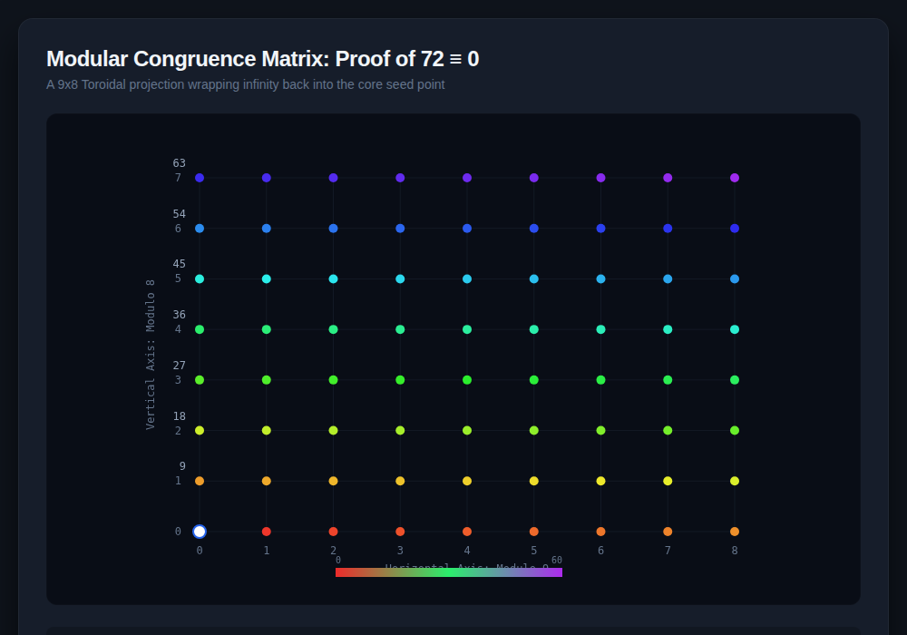

# 9x8_Matrix.html — Modular Congruence Matrix

**Reference implementation:** [`9x8_Matrix.html`](./9x8_Matrix.html)
**Screenshot:** 

## What it demonstrates

The release visualizes a single claim: **72 ≡ 0 (mod 72)** — that a 9×8 grid of
72 sequential steps wraps back onto its own starting point, like a clock face
with 72 hours instead of 12. It's a toroidal (donut-shaped) numbering scheme
rendered as a flat lattice.

- **9 columns** represent position `mod 9` (the horizontal axis).
- **8 rows** represent position `mod 8`, scaled by 9 per row — row *j* is
  labeled with both its row index (0–7) and its raw step count (`j * 9`:
  0, 9, 18, 27, 36, 45, 54, 63).
- **72 nodes total** (9 × 8), each indexed by a single step count `t` running
  0 → 72. `t = 72` lands back on the same grid position as `t = 0` — the
  white "seed" node at the bottom-left — which is the wrap-around the title
  refers to.

## How the UI works

- **Canvas grid** — a 700×500 `<canvas>` draws grid lines, axis labels, and
  one node per `(col, row)` pair. The seed node (t=0 / t=72) is drawn larger,
  white, with a blue ring so it's visually distinct from the other 71 nodes.
- **Path Progress slider (`t`)** — ranges 0–72. Dragging it calls
  `drawMatrix(t)` and `updateMetrics(t)`, which:
  - Colors every node with `t' <= t` using `getColorForStep(t')`, a hue
    sweep from red (t≈0) through green to violet (t≈72) via
    `hsl((t/72)*280, 85%, 55%)`. Nodes not yet reached stay dim gray.
  - Updates three live readouts: **Current Node Index** (`t` itself),
    **Tensor Coordinate** (`(t mod 9, floor(t/9) mod 8)` — the node's column
    and row), and **Congruence** (`t ≡ t mod 72 (mod 72)`, showing the
    "Toroid Wrapped" label once `t` reaches 72).
- **Color spectrum key** — a horizontal gradient bar under the grid maps the
  same hue sweep to a 0–60 scale, giving a visual legend for the node colors.
- No external libraries — it's a single self-contained HTML file with inline
  CSS and vanilla JS (`<canvas>` 2D context only).

## What's in the screenshot

Captured at the default load state (`t = 72`, i.e. the slider at max), so
every node is colored in and the Congruence readout shows the wrapped state:
`72 ≡ 0 (mod 72) [Toroid Wrapped]`.

---
*Part of the CORE reference series — see the project's `/img` folder for
screenshots of each release.*
