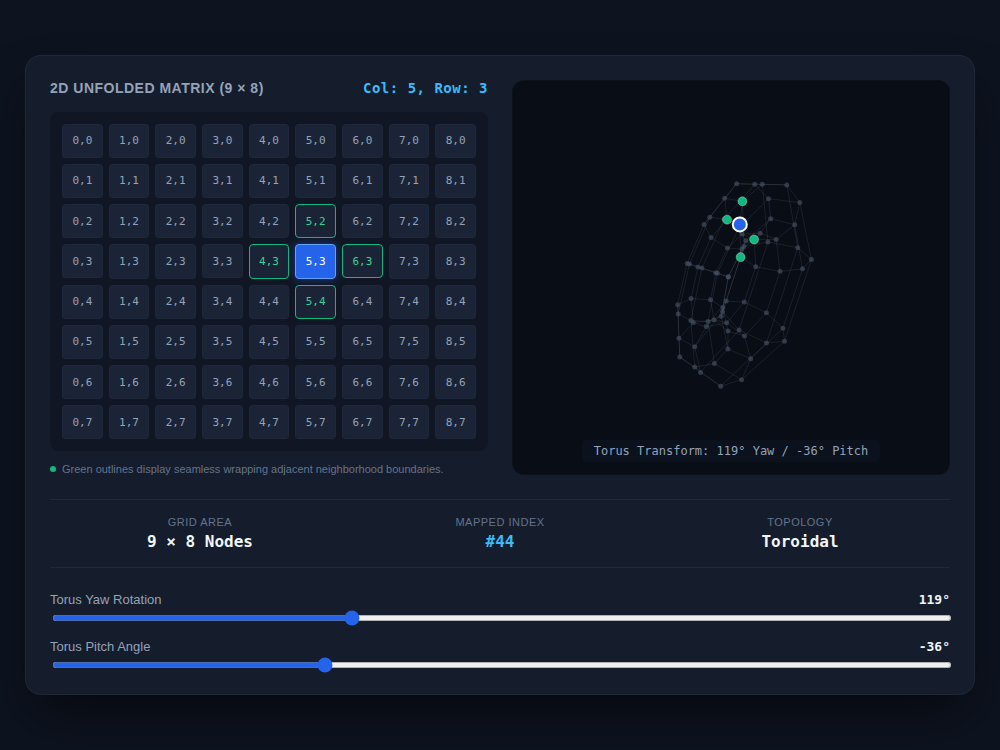

# 9x8_Torus_001.html — Toroidal Matrix Dashboard: 9x8 Tensor Bridge

**Reference implementation:** [`9x8_Torus_001.html`](./9x8_Torus_001.html)
**Screenshot:** 

## What it demonstrates

The first Torus release turns [`9x8_Matrix.html`](./9x8_Matrix.html)'s flat
72-node grid into an explicit two-view "bridge": the same 9×8 grid shown
both **unfolded** (a flat HTML grid of cells) and **folded** (a 3D torus
rendered on canvas), with hover on either view highlighting the same node's
wraparound neighbors on both.

- Grid position `(c, r)` maps to a flat index `r * 9 + c` (0–71), same
  scheme as the Matrix release.
- **Wraparound neighbors** are the point of this release: for a hovered cell,
  a horizontal neighbor is only "adjacent" if `|Δcol| === 1` *or*
  `|Δcol| === COLS - 1` (i.e. column 0 and column 8 are neighbors), and
  likewise for rows. That's the toroidal topology made concrete — the grid's
  edges wrap into each other, so it behaves like a torus even before the 3D
  view is drawn.

## How the UI works

- **2D unfolded matrix** (left panel) — a CSS grid of 72 cells labeled
  `col,row`. Hovering a cell fires `handleHover(c, r)`, which recomputes the
  active cell and outlines its wraparound neighbors in green
  (`.matrix-cell.neighbor`), while the active cell itself turns solid blue.
  The header readout above the grid shows the hovered `Col`/`Row` and the
  metrics bar below shows its `Mapped Index` (`#44` for the default
  `col=5, row=3`).
- **3D torus viewport** (right panel) — `drawTorus()` places all 72 nodes on
  a torus surface using the standard parametric torus equations
  (major radius `R=75`, minor radius `r=28`), applies a yaw then pitch
  rotation, and projects to 2D with simple perspective
  (`scale = focal / (focal + z)`). Nodes are painted back-to-front
  (`nodes.sort` by depth) so closer nodes draw over farther ones. Faint
  lines connect each node to its right (`col+1 mod 9`) and bottom
  (`row+1 mod 8`) neighbor, visually tracing the wrap.
- **Yaw / Pitch sliders** — drag either to rotate the 3D torus in place
  (0–360° yaw, -90–90° pitch); the overlay caption and metrics update live
  and the active/neighbor highlighting from the 2D grid carries over to the
  3D nodes (blue = active, green = neighbor, gray = other).
- No external libraries — a single self-contained HTML file, CSS grid for
  the flat view, canvas 2D context (no WebGL) with hand-rolled 3D projection
  for the torus view.

## What's in the screenshot

Captured at the default load state: active cell `(5, 3)` — mapped index
`#44` — with its four wraparound neighbors outlined in green on the flat
grid and highlighted in green on the 3D torus, at the default rotation
(119° yaw / -36° pitch).

---
*Part of the CORE reference series — see [`9x8_Matrix.md`](./9x8_Matrix.md)
for the release this one builds on.*
