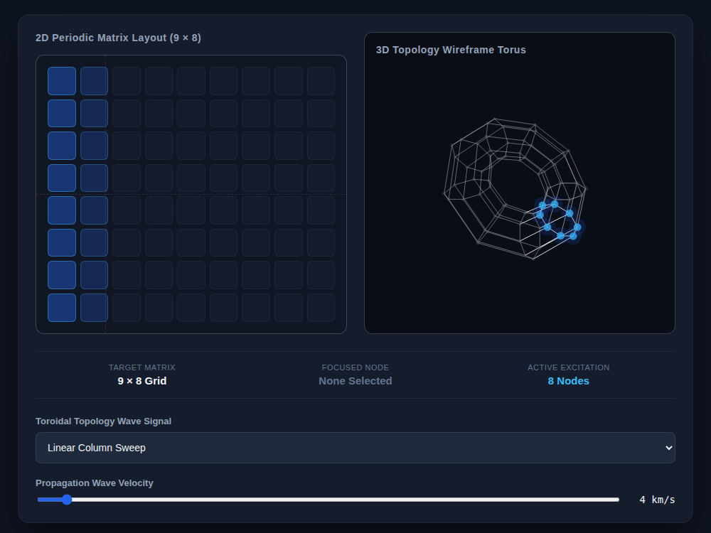

# 9x8_Torus_002.html — Toroidal Topology Wave Signal Dashboard

**Reference implementation:** [`9x8_Torus_002.html`](./9x8_Torus_002.html)
**Screenshot:** 

## What it demonstrates

Where [`9x8_Torus_001.html`](./9x8_Torus_001.md) showed a static wrap-around
adjacency, this release animates a continuous **wave signal propagating
across the toroidal surface**, in three selectable modes, rendered live on
both the flat 9×8 grid and the 3D torus.

- **Linear Column Sweep (`axial`)** — a single bright column sweeps left to
  right across the grid, wrapping instantly from column 8 back to column 0
  (shown in the screenshot: columns 0–1 lit as the sweep passes through).
- **Periodic Space Pulse (`pulse`)** — a circular wavefront expands outward
  from a slowly drifting center point, using *toroidal* (wrap-shortened)
  distance so the ripple continues seamlessly across the grid edges.
- **Helical Angular Ring (`orbit`)** — a diagonal band spirals across the
  grid, driven by a phase term combining column and row position.

All three intensity functions live in `evaluateWaveIntensity(c, r, time,
speed, mode)`, each returning 0–1 per node per animation frame.

## How the UI works

- **Animation loop** — `updateSimulation()` calls itself via
  `requestAnimationFrame`, advancing `waveTime` each frame, recomputing
  every node's intensity, and repainting both views continuously (this is
  the first release in the series that animates rather than only responding
  to input).
- **2D matrix** (left) — each cell's background alpha is driven directly by
  its wave intensity (`intensity > 0.3` counts as "excited" and is tallied
  in the **Active Excitation** metric); hovering a cell reports its
  `Col`/`Row` in **Focused Node** and pins it white/blue regardless of the
  wave.
- **3D torus** (right) — same parametric torus + perspective projection as
  `9x8_Torus_001.html`, but now **draggable**: mouse-down and drag rotates
  the view (`rotX`/`rotY` updated from mouse delta) instead of using
  sliders. Node radius and glow scale with wave intensity, and the hovered
  node (synced from the 2D grid) is drawn white with a cyan ring.
- **Signal Type dropdown** — switches `mode` between the three wave
  functions above; **Propagation Wave Velocity slider** (2–50 km/s) scales
  how fast the pattern moves.
- No external libraries — self-contained HTML/CSS/canvas, no WebGL.

## What's in the screenshot

Captured mid-animation in the default **Linear Column Sweep** mode at
4 km/s: the wavefront is crossing columns 0–1, shown lit on the flat grid
and highlighted blue on the corresponding torus nodes; 8 nodes are counted
as excited.

---
*Part of the CORE reference series — builds on
[`9x8_Torus_001.md`](./9x8_Torus_001.md).*
