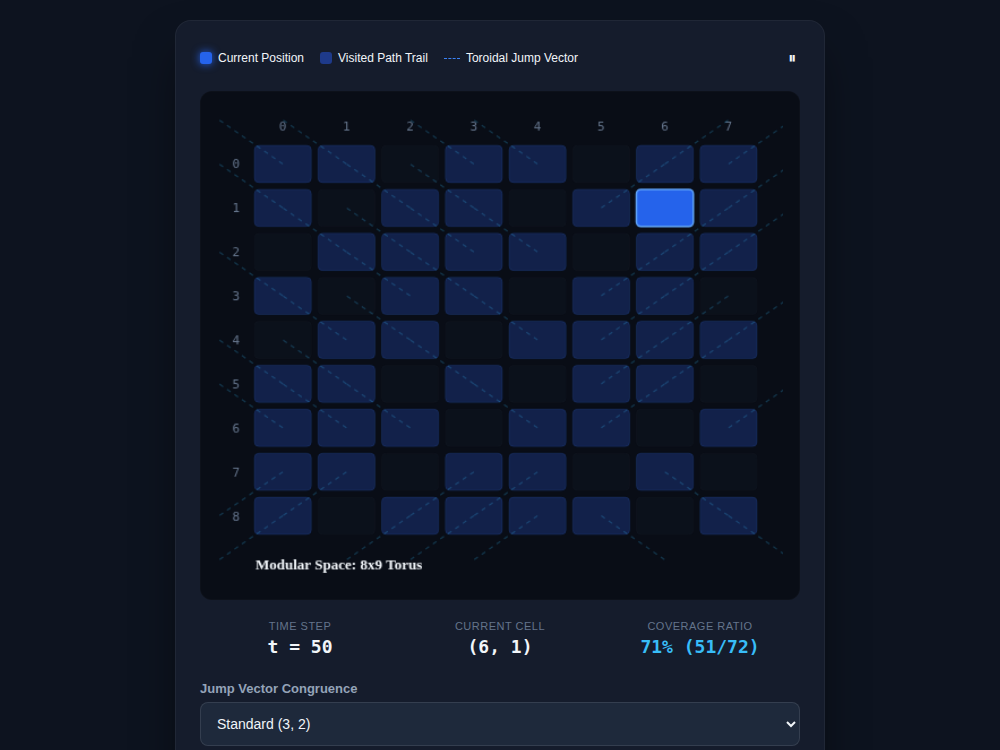

# 9x8_Torus_003.html — Modular Space: 8x9 Torus Traversal Engine

**Reference implementation:** [`9x8_Torus_003.html`](./9x8_Torus_003.html)
**Screenshot:** 

## What it demonstrates

Where the earlier releases explored a single fixed step sequence
(`t = r*9 + c`, always +1), this release generalizes to **arbitrary jump
vectors** on an 8×9 torus (72 nodes, same total, axes swapped from the
Matrix release: 8 columns × 9 rows here): from position `(x, y)`, each step
moves by a fixed `(stepX, stepY)` and wraps with `% COLS` / `% ROWS`. It
visualizes the resulting path, how much of the grid it covers, and where it
crosses the toroidal edge.

- **Jump Vector Congruence** — four selectable `(stepX, stepY)` pairs:
  Standard `(3,2)`, Asymmetric Loop `(5,2)`, Linear Step `(1,1)`, and Prime
  Hyper-Step `(7,4)`. Because `gcd` of the step components with the grid
  dimensions varies, different vectors visit different numbers of unique
  cells before repeating — this is the **Coverage Ratio** metric
  (`unique cells visited / 72`, e.g. 71% / 51 of 72 for the default vector
  at `t=50`, since `(3,2)` against `(8,9)` doesn't have full coverage at
  that many steps).
- **Toroidal Jump Vector lines** connect consecutive path steps; a step
  whose `|Δx| > 1` or `|Δy| > 1` is a **wrap** (it crossed the grid edge),
  drawn as a short dashed stub toward the boundary instead of a long line
  across the whole grid — keeping the wrap visually local rather than
  drawing a distracting diagonal across the canvas.

## How the UI works

- **Canvas grid** — `generatePath(limitT, stepX, stepY)` recomputes the
  entire walk from `t=0` up to the current step every render (simple, not
  performance-critical at 72 nodes). Cells are shaded by role: current
  position (bright blue, ringed), visited (translucent blue), unvisited
  (dim).
- **Path Progress Timeline** — a slider plus `<` / `>` step buttons scrub
  `t` from 0–72; the readouts (**Time Step**, **Current Cell**, **Coverage
  Ratio**) update live.
- **Play/Pause** — animates `t` forward automatically (150ms per step,
  `requestAnimationFrame` + `setTimeout` throttle), wrapping `t` back to 0
  after 72. Note: the play/pause icon shows "⏸" (pause) on page load even
  though playback is **not** running by default — the icon only reflects
  state correctly after the first click.
- No external libraries — self-contained HTML/canvas, no 3D view in this
  release (2D traversal only).

## What's in the screenshot

Captured at the default load state: vector `(3,2)`, `t = 50`, current cell
`(6, 1)`, coverage 71% (51/72 unique cells visited so far). Diagonal dashed
lines mark the toroidal jump trail, including short stub lines where the
path wraps across an edge.

---
*Part of the CORE reference series — this release re-derives the
72-node/toroidal ideas from [`9x8_Matrix.md`](./9x8_Matrix.md) and
[`9x8_Torus_001.md`](./9x8_Torus_001.md) with generalized step vectors.*
