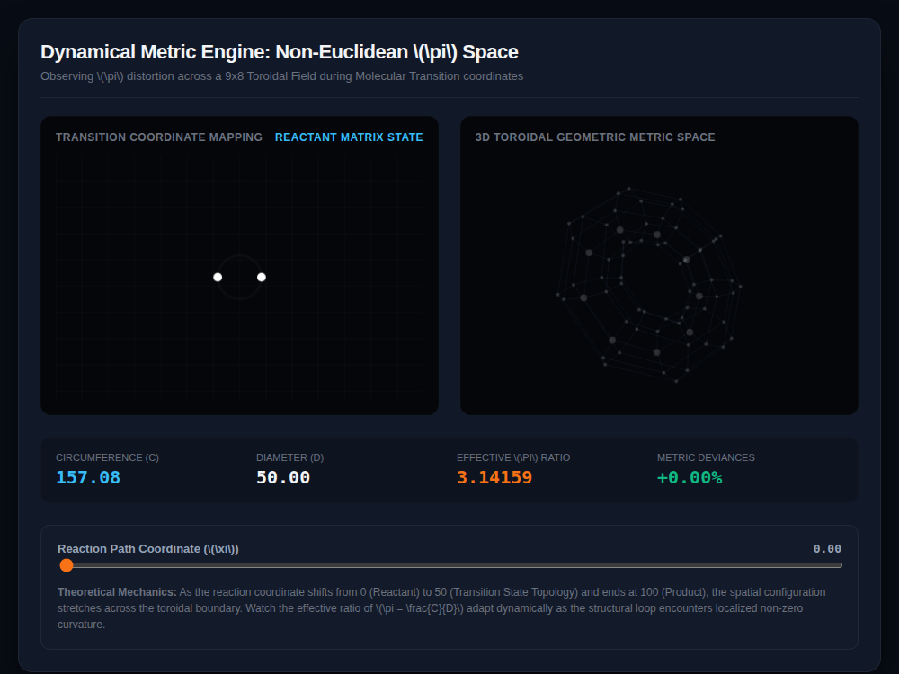

# 9x8_Torus_004.html — Dynamical Metric Engine: Non-Euclidean π Space

**Reference implementation:** [`9x8_Torus_004.html`](./9x8_Torus_004.html)
**Screenshot:** 

## What it demonstrates

This release reframes the 9×8 torus as a **chemistry metaphor**: a
molecular reaction coordinate (`ξ`, 0–100) walking from Reactant → Transition
State → Product, with the torus surface warping in step. The point is to
show that **π (circumference / diameter) is only constant in flat Euclidean
space** — as the modeled geometry deforms, the effective ratio of a measured
loop's circumference to its diameter drifts away from 3.14159.

- **Deformation factor** = `sin(progress * π)`, which peaks at the midpoint
  (`ξ = 50`, the "saddle point" / transition state) and is zero at both
  ends (Reactant/Product) — modeling maximum distortion at the transition
  state, none at the stable basins.
- **Effective π Ratio** — an ellipse is stretched by the deformation factor
  (`stretchX` grows, `stretchY` shrinks), its circumference approximated via
  the Ramanujan ellipse-circumference formula, then divided by its diameter.
  At `ξ = 0` the ellipse is a circle (deformation = 0), so the ratio reads
  exactly `3.14159` with `0.00%` deviance; moving the slider shows it drift.
- **3D torus** — the same warp is applied to the full 9×8 torus surface
  (`scaleWarp` depends on `sin(theta)` and the deformation factor), and one
  ring of nodes (`r === 2`) is highlighted as the "measuring loop" whose
  metric is being tracked.

## How the UI works

- **Reaction Path Coordinate slider** (0–100) drives everything: the state
  label (Reactant / Quantum Transition State / Product, thresholded at 35
  and 65), the 2D ellipse view, the 3D torus warp, and all four analytics
  readouts (Circumference, Diameter, Effective π Ratio, Metric Deviance %).
- **2D viewport** (left) draws a faint grid plus the deformed ellipse with a
  glow, and two white "nucleophilic center" points at its horizontal
  extremes.
- **3D viewport** (right) — same parametric-torus-plus-perspective approach
  as the earlier Torus releases, with the deformation-driven `scaleWarp`
  applied before projection.
- Minor implementation quirk: the canvas `strokeStyle`/`fillStyle` calls use
  CSS custom-property syntax (`'var(--accent-orange)'`), which the Canvas
  2D API does not resolve — those specific highlight colors silently no-op
  and keep whatever color was last set, rather than switching to orange at
  the saddle point as the code intends.
- No external libraries — self-contained HTML/canvas, includes inline LaTeX
  literal text (`\(\pi\)`, `\(\xi\)`) in the markup with no MathJax/KaTeX
  loaded, so those render as raw backslash-paren text rather than typeset
  math (visible in the screenshot's heading).

## What's in the screenshot

Captured at the default load state (`ξ = 0`, Reactant Matrix State): a
circular (undeformed) loop, Circumference 157.08, Diameter 50.00, Effective
π Ratio 3.14159, Metric Deviance +0.00% — confirming the ratio only departs
from true π once the slider moves off the reactant basin.

---
*Part of the CORE reference series — extends the 9×8 torus geometry from
[`9x8_Torus_001.md`](./9x8_Torus_001.md) with a dynamic, chemistry-themed
deformation.*
