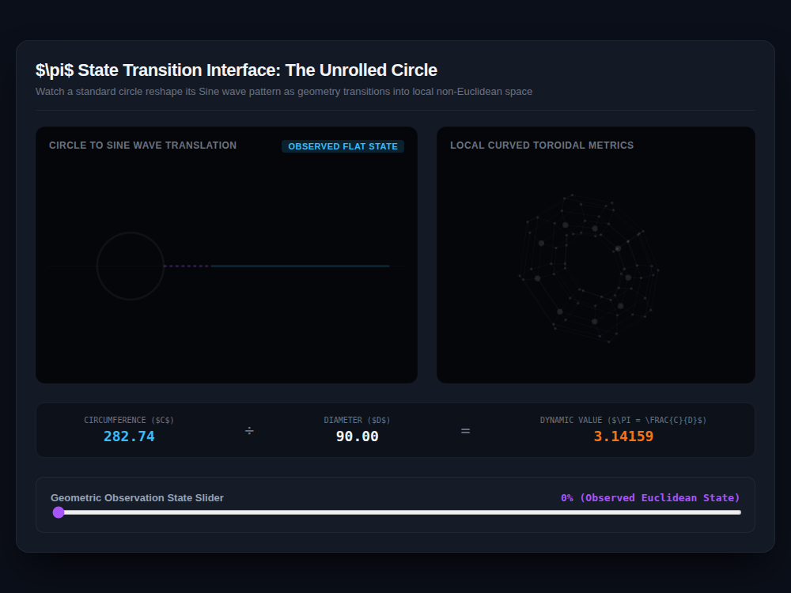

# 9x8_Torus_005.html — Geometric Phase Transition Dashboard: Visualizing Dynamic Pi

**Reference implementation:** [`9x8_Torus_005.html`](./9x8_Torus_005.html)
**Screenshot:** 

## What it demonstrates

A companion piece to [`9x8_Torus_004.html`](./9x8_Torus_004.md): same "π
drifts under non-Euclidean deformation" idea, but visualized as a circle
being **unrolled into a sine wave** rather than a chemistry reaction
coordinate. At 0% deformation the loop is a perfect circle and its unrolled
trace is a flat line (amplitude 0); as the **Geometric Observation State**
slider moves toward 50%, the loop deforms into a warped ellipse-like shape
and the unrolled trace becomes a visible sine wave whose amplitude tracks
the deformation directly — literally showing "how bent the circle is" as a
wave.

- Same `deformation = sin(factor * π)` shape as release 004: zero at 0%
  and 100%, maximum at 50%.
- **Formula strip** shows live Circumference, Diameter, and the resulting
  `C/D` ratio — again reading exactly `3.14159` only at the two flat
  (Euclidean) endpoints.
- **3D torus** (right) gets the same local warp applied to one column
  direction, with the `r=2` ring highlighted as the tracked measuring loop,
  consistent with release 004.

## How the UI works

- **Left viewport** — draws the deforming loop (`radialWarp` adds a
  `sin(2·angle)` ripple scaled by deformation) and, to its right, the
  "unrolled" sine wave whose amplitude is `radiusY * 0.6 * deformation`. A
  dashed purple connector line links the loop's rightmost point to the start
  of the wave, visually suggesting "cut here and unroll."
  - The wave has a continuous phase animation (`wavePhase`, advanced via
    `requestAnimationFrame` whenever the slider is above 0%) so it visibly
    ripples even without touching the slider — this release is animated,
    unlike 004.
- **Right viewport** — parametric torus + perspective projection, same
  pattern as releases 001–004.
- Same implementation quirk as 004: several `strokeStyle`/`fillStyle`
  assignments use CSS `var(--accent-blue)` / `var(--accent-orange)` syntax,
  which Canvas 2D doesn't resolve, so those elements render in whatever
  color was last validly set rather than the intended accent (visible in
  the screenshot: the circle outline is gray, not the intended blue).
- The heading and formula labels use raw LaTeX delimiters (`$\pi$`,
  `\(\pi\)`-style, `\frac{C}{D}`) with no MathJax/KaTeX included, so they
  render as literal text rather than typeset math — same as release 004.

## What's in the screenshot

Captured at the default load state (slider at 0%, "Observed Flat State"): a
clean circle with a flat (zero-amplitude) unrolled trace, Circumference
282.74, Diameter 90.00, ratio 3.14159.

---
*Part of the CORE reference series — a variant presentation of
[`9x8_Torus_004.md`](./9x8_Torus_004.md)'s dynamic-π idea.*
