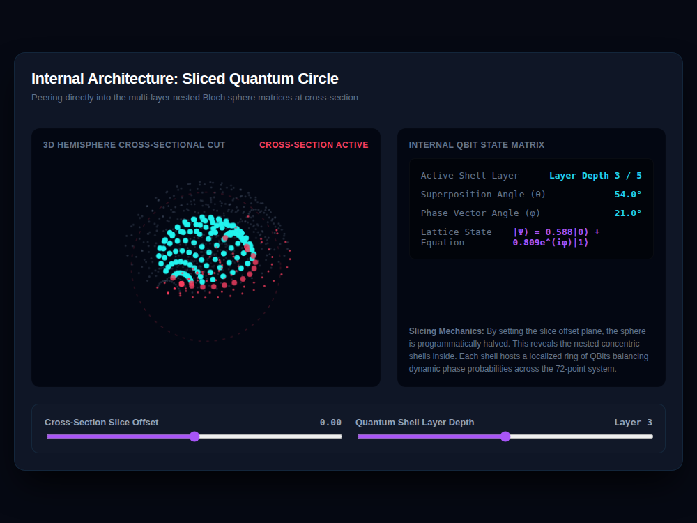

# 9x8_Torus_006.html — 3D Sliced Quantum Circle: QBit Internal Architecture

**Reference implementation:** [`9x8_Torus_006.html`](./9x8_Torus_006.html)
**Screenshot:** 

## What it demonstrates

A departure from the flat 9×8 grid used in releases 001–005: this release
builds **5 nested concentric spherical shells** of "QBit" particles and lets
you cut a cross-section through them to see the internal layers, framed as
a quantum-mechanical Bloch-sphere metaphor (superposition angle θ, phase
angle φ, the state equation `|Ψ⟩ = α|0⟩ + βe^(iφ)|1⟩`).

- **5 shells**, radius `s * 24` for shell `s = 1..5`, each populated with
  `12 + s*4` nodes around a latitude ring, each duplicated across
  longitude — more nodes per shell the further out you go.
- **Cross-section slicing** — any node whose Y-coordinate exceeds the
  **Cross-Section Slice Offset** is simply not drawn (`isCutAway`), which
  visually halves the sphere and exposes its interior; nodes right at the
  cut plane are flagged `isEdgeNode` and highlighted magenta/red as the rim.
- **Quantum Shell Layer Depth slider** picks which of the 5 shells is the
  "active" one — its nodes are drawn larger and pulse cyan, and the state
  readouts (θ, φ, α, β) are derived from the selected layer index
  (`θ = layer * 18°`).

## How the UI works

- **3D viewport** — same painter's-algorithm approach as the torus
  releases (depth-sort, then draw back-to-front), but spherical rather than
  toroidal geometry, and **draggable** to rotate (mouse-down + drag, no
  sliders for rotation this time).
- **Continuous animation** — `stepClock()` runs every frame via
  `requestAnimationFrame`, advancing `localPhaseClock`, which drives a
  subtle brightness pulse on the active shell's nodes; it runs from page
  load, not gated behind any control.
- **Internal QBit State Matrix panel** (right) — a live readout of Active
  Shell Layer, Superposition Angle, Phase Vector Angle, and the resulting
  state equation, all recomputed from the Layer slider.
- **Cross-Section Slice Offset slider** (-50 to 50) moves the cut plane; a
  dashed red ring overlay marks where the cut intersects the outer
  boundary.
- The description text references "the 72-point system," carrying forward
  the 9×8=72 node count from earlier releases even though this particular
  visualization's shells don't total 72 nodes themselves (shell node counts
  here are 16, 20, 24, 28, 32 latitude positions × longitude subdivisions,
  a different generative scheme than the flat grid).
- No external libraries — self-contained HTML/canvas.

## What's in the screenshot

Captured at the default load state: Slice Offset 0.00 (perfect half),
Layer 3 selected (Superposition Angle 54.0°, Phase 21.0° at capture time
since the phase clock runs continuously), showing the sliced hemisphere
with the active shell's nodes in cyan and the cut-plane rim in red/magenta.

---
*Part of the CORE reference series — shifts from toroidal to spherical
("QBit shell") geometry; compare with the flat-grid approach in
[`9x8_Torus_001.md`](./9x8_Torus_001.md).*
