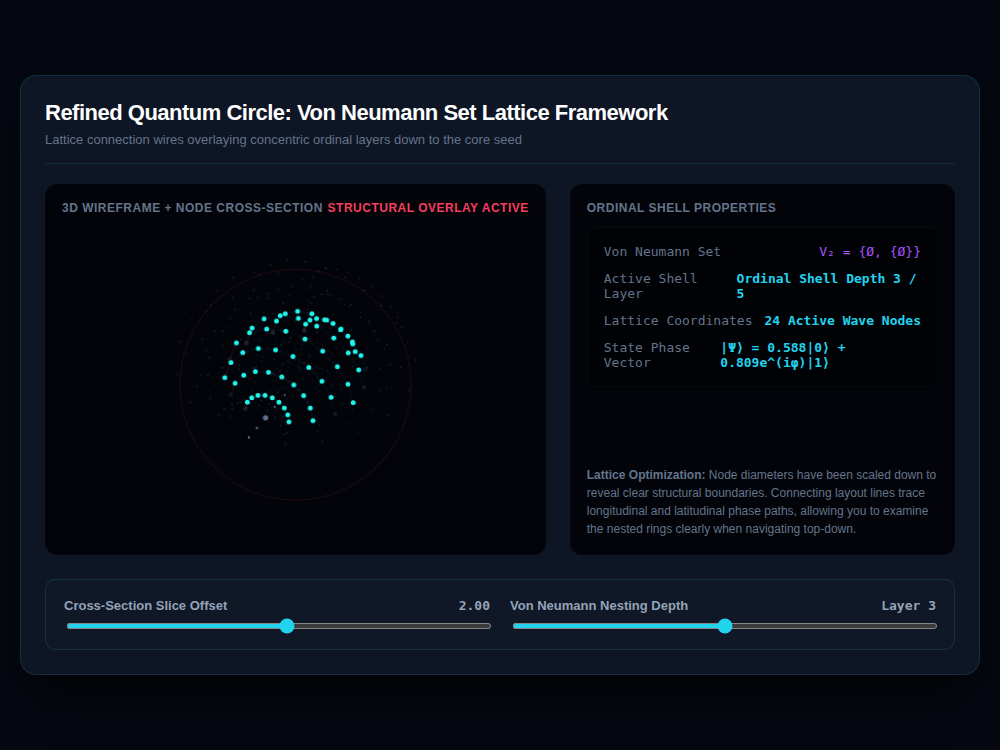

# 9x8_Torus_007.html — Refined 3D Quantum Circle: Von Neumann Nested Architecture

**Reference implementation:** [`9x8_Torus_007.html`](./9x8_Torus_007.html)
**Screenshot:** 

## What it demonstrates

A direct refinement of [`9x8_Torus_006.html`](./9x8_Torus_006.md): the same
5-shell sliced-sphere idea, but now labels each shell using **Von Neumann
ordinal set construction** (`V₀ = Ø`, `V₁ = {Ø}`, `V₂ = {Ø, {Ø}}`, …) as a
conceptual stand-in for "each layer contains/builds on the one before it" —
and reorganizes each shell's nodes into explicit latitude **rings** with
lattice wires connecting neighboring nodes within a ring, rather than 006's
looser point cloud.

- **Layer → Von Neumann label mapping**: the slider's Layer 1–5 maps to
  `setNotations[layer-1]`, so Layer 3 shows `V₂ = {Ø, {Ø}}` — the ordinal
  index is one behind the layer number (`V₀` for Layer 1, etc.), a labeling
  choice carried straight from the array's 0-based indexing.
- **8 rings per shell**, `12 + shell*2` nodes per ring — a different
  (smaller) per-ring node count than 006's per-shell total, giving denser,
  more organized latitude bands.
- Cross-section slicing works identically to 006 (nodes with `y0 > offset`
  are dropped), but the **connection lines** are new: each active-layer node
  is wired to its next neighbor in the same ring (`nodeIdx + 1 mod
  maxNodes`), tracing visible latitude circles instead of scattered points;
  non-active layers get the same wiring but only 15% of lines are drawn
  (`Math.random() < 0.15`) to keep the background from becoming visual
  noise.

## How the UI works

- Same two-panel layout, drag-to-rotate 3D viewport, and continuous
  `requestAnimationFrame` pulse animation as 006.
- **Ordinal Shell Properties panel** now shows the Von Neumann Set notation
  alongside Active Shell Layer, Lattice Coordinates (active node count), and
  the same quantum state-vector equation as 006.
- Node radii are smaller than 006's ("Node diameters have been scaled down"
  per the on-page note) specifically so the ring-wire structure reads
  cleanly.
- Same minor quirk as release 006: one fill color
  (`ctx.fillStyle = 'var(--accent-magenta)'` for edge nodes) uses CSS
  custom-property syntax that Canvas 2D doesn't resolve, so edge nodes
  don't actually render magenta.
- No external libraries — self-contained HTML/canvas.

## What's in the screenshot

Captured at the default load state: Slice Offset 2.00, Layer 3 (`V₂ = {Ø,
{Ø}}`), 24 active wave nodes, showing the ring-latticed hemisphere with the
active layer's rings traced in cyan.

---
*Part of the CORE reference series — refines
[`9x8_Torus_006.md`](./9x8_Torus_006.md)'s shell-slicing concept with
explicit ring lattices and set-theoretic layer labels.*
