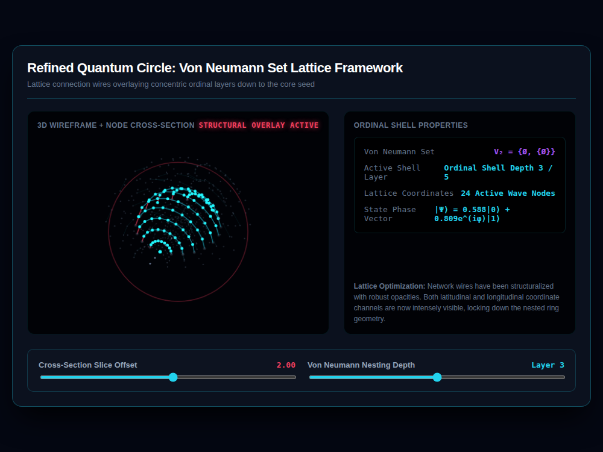

# 9x8_Torus_008.html — High-Contrast Quantum Circle: Von Neumann Nested Architecture

**Reference implementation:** [`9x8_Torus_008.html`](./9x8_Torus_008.html)
**Screenshot:** 

## What it demonstrates

A visual-polish pass on [`9x8_Torus_007.html`](./9x8_Torus_007.md) — same
Von Neumann ordinal shell labeling and ring-lattice structure, tuned for
legibility rather than new math:

- **Denser rings**: 10 rings per shell (up from 8) and `14 + shell*2` nodes
  per ring (up from `12 + shell*2`).
- **Bolder wires**: active-layer connection lines are drawn at higher
  opacity and 2x the line width (1.5px vs 0.5px), and background
  (non-active-layer) wires are both more frequent (25% sampled vs 15%) and
  more visible (0.12 alpha vs 0.04) — matching the on-page note ("Network
  wires have been structuralized with robust opacities").
- **Slice rim and offset readout** are now drawn/colored in a much more
  saturated red (`rgba(244,63,94,0.35)` vs 007's `0.15`), and the "Slice
  Offset" and "Nesting Depth" values in the controls panel are bolded and
  colored to match, so both the 3D cut plane and its numeric readout are
  easier to track together.
- Title bar text also upgrades to a bolder, glowing, letter-spaced
  "STRUCTURAL OVERLAY ACTIVE" banner (text-shadow glow effect) versus 007's
  plain colored text.

The math and interaction model are otherwise identical to 007 — this
release is a contrast/legibility iteration, not a new concept.

## How the UI works

Same as [`9x8_Torus_007.html`](./9x8_Torus_007.md): drag-to-rotate 3D
viewport, Cross-Section Slice Offset and Von Neumann Nesting Depth sliders,
continuous pulse animation, and the same Canvas `var(--accent-magenta)`
quirk on edge-node fill color (still doesn't resolve, so edge nodes render
in the fallback gray/cyan scheme rather than magenta).

## What's in the screenshot

Captured at the default load state: Slice Offset 2.00, Layer 3 (`V₂ = {Ø,
{Ø}}`), 24 active wave nodes — visibly denser rings and a much brighter red
slice-boundary circle than 007's equivalent capture.

---
*Part of the CORE reference series — a contrast/legibility refinement of
[`9x8_Torus_007.md`](./9x8_Torus_007.md).*
