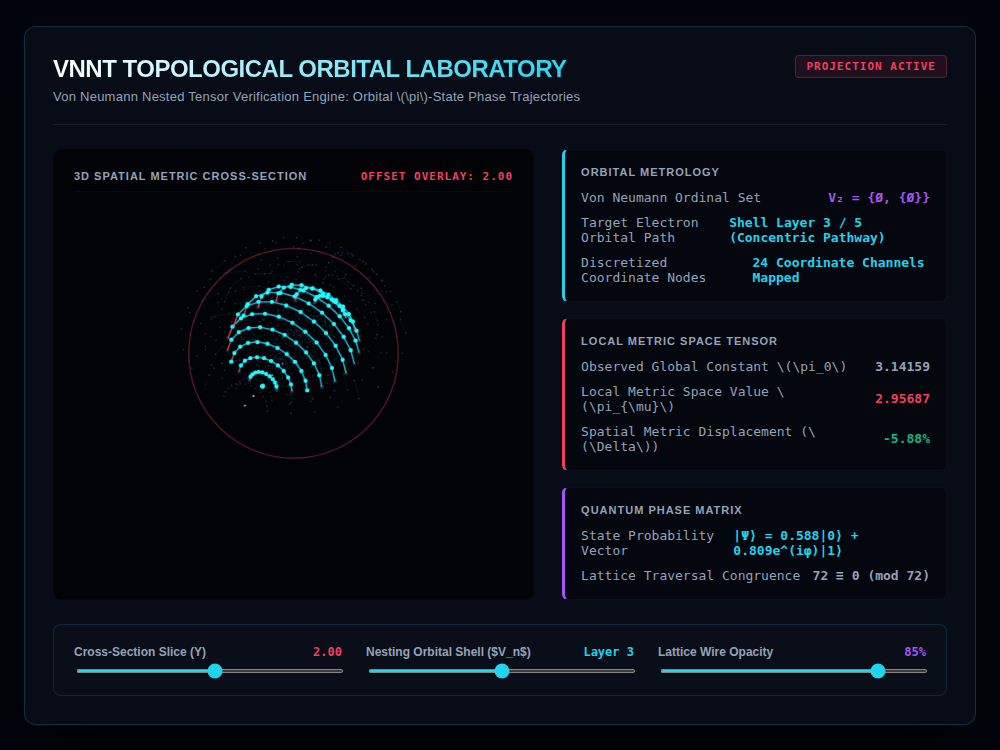

# 9x8_Torus_009.html — VNNT Quantum Orbital Analytical Suite

**Reference implementation:** [`9x8_Torus_009.html`](./9x8_Torus_009.html)
**Screenshot:** 

## What it demonstrates

This release merges the two threads the series has developed separately —
the **Von Neumann nested shell lattice** (releases 006–008) and the
**dynamic/non-Euclidean π** idea (releases 004–005) — into one "analytical
suite" with three telemetry cards, plus reintroduces the `72 ≡ 0 (mod 72)`
congruence line from [`9x8_Matrix.html`](./9x8_Matrix.md) as an explicit
readout, tying the whole series back to its origin point.

- **Orbital Metrology card** — Von Neumann ordinal set label, active shell
  layer, and coordinate-node count (`12 + layer*4`), same as 007/008.
- **Local Metric Space Tensor card** — a new, simpler π-deformation formula
  than releases 004/005: `localWarp = -0.02 * layer * (1 - |slice|/50 * 0.5)`,
  `dynamicPi = π * (1 + localWarp)`. Unlike 004/005 (deformation peaks at a
  midpoint and returns to 0), here the local π value depends on **which
  shell layer and how far the cross-section slice is offset** — deeper
  layers and smaller slice offsets produce larger deviation from
  3.14159 (shown as a negative "Spatial Metric Displacement" percentage).
- **Quantum Phase Matrix card** — the same state-vector equation as
  006–008, plus the `72 ≡ 0 (mod 72)` congruence label, presented as if it
  were a live-computed property of the lattice rather than a fixed
  constant carried over from `9x8_Matrix.html`.
- **New Lattice Wire Opacity slider** (10–100%) directly controls the alpha
  of the active layer's connection wires — the first release in the shell
  series to expose wire opacity as a live control rather than a fixed
  value.

Note: the header telemetry card's "Discretized Coordinate Nodes" label
initially reads "72 Unified Channels" in the markup default, but the live
value it's replaced with (`12 + layer*4` per shell) is a per-shell count,
not the fixed 72 total from the flat-grid releases — the "72" here is
decorative/thematic continuity rather than a literal recomputation.

## How the UI works

Same 3D drag-to-rotate cross-section viewport and continuous pulse
animation as releases 006–008, now built with 12 rings × `16 + shell*2`
meridians per shell (denser than 008's 10×(14+shell*2)). Three sliders:
Cross-Section Slice (Y), Nesting Orbital Shell, and the new Lattice Wire
Opacity, all wired to `runAnalyticalEngine()`. Same Canvas
`var(--magenta-glow)` quirk as prior releases (the CSS-variable fill color
for cut-plane-rim nodes doesn't resolve in Canvas 2D).

## What's in the screenshot

Captured at the default load state: Slice 2.00, Layer 3, Wire Opacity 85%.
Local Metric Space Value reads 2.95687 against the constant 3.14159, a
-5.88% displacement — larger than any deviation the earlier π-focused
releases (004/005) showed at their default states, since this formula's
baseline (layer 3, slice 2) isn't a "flat/undeformed" reference point the
way `ξ=0` was there.

---
*Part of the CORE reference series — combines
[`9x8_Torus_008.md`](./9x8_Torus_008.md)'s shell lattice with the dynamic-π
concept from [`9x8_Torus_004.md`](./9x8_Torus_004.md).*
