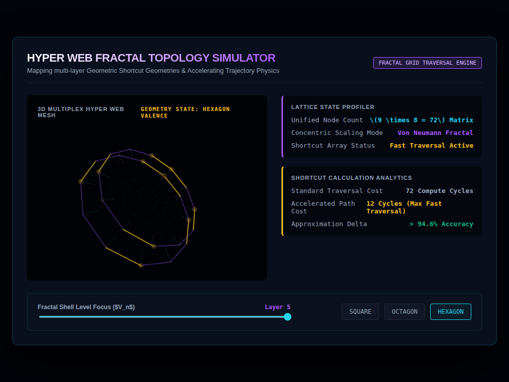

# 9x8_Torus_010.html — VNNT Hyper Web Fractal Topology Simulator

**Reference implementation:** [`9x8_Torus_010.html`](./9x8_Torus_010.html)
**Screenshot:** 

## What it demonstrates

A new idea grafted onto the same 5-shell Von Neumann structure: **regular
polygon rings** (square, octagon, or hexagon) at each shell radius, with
specific vertices flagged as low-cost "shortcut" paths across the lattice —
framed as a traversal-cost optimization (72 "compute cycles" for a full
walk vs. as few as 4–12 via the shortcuts, depending on symmetry).

- **Symmetry selector** (Square / Octagon / Hexagon buttons) sets how many
  points sit on each shell's ring: 4, 8, or 12 respectively (the button
  labeled "Hexagon" actually places 12 points per ring — two vertices per
  hexagon corner/edge-time-step, described in the UI as "Hexagon Valence,"
  i.e. a 12-point construction motivated by hexagonal symmetry rather than
  a literal 6-gon).
- **Shortcut detection** — a node is flagged as a shortcut path when its
  angle is within 2° of a multiple of 45° or 60°: the geometrically special
  directions for square/octagon and hexagon symmetry respectively. Only
  hexagon mode actually renders these in amber; the accelerated-path cost
  readout (4/8/12 cycles) changes per symmetry mode via `setSymmetry()`.
- **Double-sided shells** — each ring is drawn twice, offset slightly in Z
  (`layerZ = ±1`), giving each shell ring's a subtle 3D thickness rather
  than being a flat disk.
- **Cross-layer beams** — faint cyan lines connect each node in the focused
  shell down to the corresponding node in the shell one layer below,
  visualizing the "fractal" nesting between shells (visible as the faint
  radial lines inside the outer ring in the screenshot).

## How the UI works

- **Fractal Shell Level Focus slider** (1–5) picks which shell is
  highlighted with bold rings, shortcut markers, and cross-layer beams; all
  others fade into a dim background mesh (30% of their ring segments
  sparsely drawn, matching the "dim background" pattern from releases
  007–009).
- **Symmetry buttons** switch the point count and re-run
  `setSymmetry()`/`renderHyperWeb()` immediately.
- Drag-to-rotate 3D viewport and continuous pulse animation, same pattern
  as the rest of the shell series.
- Same Canvas `var(--amber-glow)` / `var(--purple-glow)` CSS-variable
  fill-color quirk as prior releases — those specific fills don't resolve,
  though the screenshot shows the stroke-based ring colors (which use
  literal `rgba(...)` values, not CSS vars) rendering correctly.

## What's in the screenshot

Captured at the default load state: Hexagon symmetry, Shell Layer 5 —
outer amber 12-point ring (shortcut paths highlighted) with a fainter
purple ring from shell 4 connected by thin cross-layer beams, and the
telemetry panel showing "12 Cycles (Max Fast Traversal)" and ">94.6%
Accuracy" for the hexagon shortcut approximation.

---
*Part of the CORE reference series — introduces polygon-symmetry shortcut
paths on the shell structure established in
[`9x8_Torus_006.md`](./9x8_Torus_006.md)–[`009`](./9x8_Torus_009.md).*
