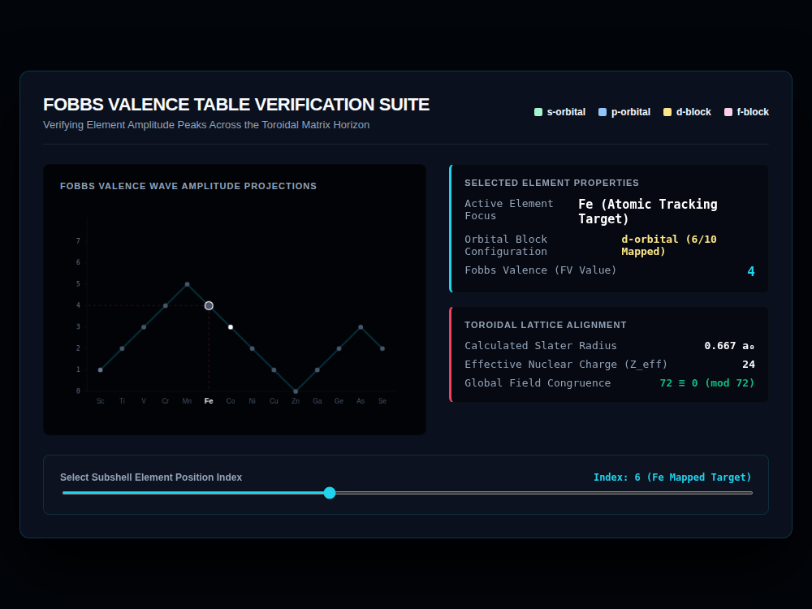

# 9x8_Torus_011.html — Fobbs Valence Topological Analyzer

**Reference implementation:** [`9x8_Torus_011.html`](./9x8_Torus_011.html)
**Screenshot:** 

## What it demonstrates

A sharp pivot from the 3D shell/torus visualizations (releases 006–010)
back to a 2D chart, and the first release to name its own metric — the
**"Fobbs Valence" (FV)** — after a coined per-element value tracked across
the periodic table's d-block and into the p-block. It's presented as
"verifying element amplitude peaks," i.e. checking that a hand-built FV
value per element traces a smooth rise-and-fall wave rather than jumping
around.

- **Dataset**: 14 hardcoded elements (Sc through Se) each with a symbol,
  an orbital-block description string, and an FV integer. The d-block
  (Sc→Zn) FV values rise 1→5 then fall 4→0 (peaking at Mn, index 5), then
  the p-block entries (Ga→Se) rise again 1→2→3 then dip to 2. This mirrors
  the real shape of "number of unpaired d-electrons across the first
  transition series" (which peaks at Mn's half-filled d⁵ configuration),
  though the FV numbers themselves are this release's own construction,
  not pulled from a physical-constants table.
- **Toroidal Lattice Alignment card** carries over `72 ≡ 0 (mod 72)` from
  the matrix/shell releases as a fixed decorative constant, alongside a
  Slater Radius and Effective Nuclear Charge that are also static text (not
  recomputed per element despite sitting next to the element selector).

## How the UI works

- **Element Position Index slider** (1–14) selects the active element from
  the hardcoded array; the chart, the "Selected Element Properties" card,
  and the index label all update from `dBlockData[currentIdx - 1]`.
- **Wave chart** — a simple line-and-marker plot: FV value on the Y-axis
  (0–7), element position on the X-axis, symbols labeled along the bottom.
  The selected element's point is enlarged, ringed white, and gets dashed
  guide lines down to the X-axis and across to the Y-axis, making its exact
  FV value easy to read off.
- **Legend** (top right: s/p/d/f-orbital color dots) is present but not
  fully wired up — only d-color and p-color are actually used in
  `renderValenceWave()` (`i < 10 ? d-color : p-color`); s-orbital and
  f-block colors are declared but never assigned to any point in this
  14-element dataset.
- Same Canvas `var(--magenta-glow)` CSS-variable quirk as prior releases
  (the selected-point fill color doesn't resolve; the screenshot shows the
  marker rendering white/gray instead).
- No external libraries, no 3D — self-contained HTML/canvas 2D chart.

## What's in the screenshot

Captured at the default load state: Index 6, element **Fe (Iron)**,
d-orbital (6/10 mapped), FV = 4 — one step down from the Mn peak (FV = 5)
at index 5, matching the described "amplitude peak" shape.

---
*Part of the CORE reference series — a chemistry-themed metric distinct
from the geometric/quantum shell exploration in
[`9x8_Torus_006.md`](./9x8_Torus_006.md)–[`010`](./9x8_Torus_010.md).*
