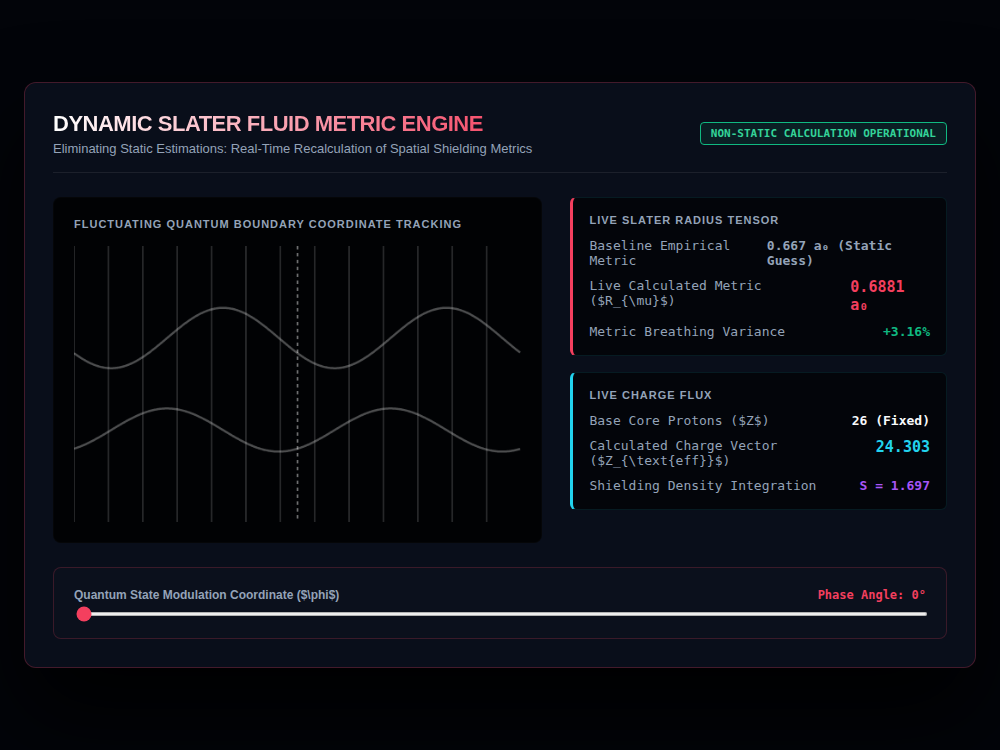

# 9x8_Torus_012.html — Dynamic Slater Metric Quantum Engine

**Reference implementation:** [`9x8_Torus_012.html`](./9x8_Torus_012.html)
**Screenshot:** 

## What it demonstrates

A follow-up to [`9x8_Torus_011.html`](./9x8_Torus_011.md)'s static
"Calculated Slater Radius" and "Effective Nuclear Charge" readouts: this
release makes both values **continuously animate** ("breathe") as sine/
cosine waves instead of sitting fixed, framed as "eliminating static
estimations" in favor of a live recalculation.

- **Live Slater Radius** oscillates around the 011 baseline (0.667 a₀) by
  ±0.042 via `sin(2·phase + clock·0.05)`, shown alongside a live % variance
  from baseline.
- **Live Effective Nuclear Charge (Z_eff)** oscillates around 24.0 by ±0.35
  via `cos(2·phase + clock·0.05)` — the inverse trig function of the radius
  term, so the two values drift out of phase with each other rather than
  moving in lockstep.
- **Shielding Density (S)** is derived, not independently animated:
  `S = 26 - Z_eff` (26 being iron's fixed proton count, carried over from
  the Fe focus in release 011), so it moves opposite to Z_eff automatically.
- Both relationships are illustrative framing over the underlying trig
  wave, not a physically derived shielding model — the point of the release
  is the live-recalculation presentation, not a new physics formula.

## How the UI works

- **Quantum State Modulation Coordinate (φ) slider** (0–360°) sets the
  phase offset for both waves; a continuous `automaticTimelineClock`
  (driven by `requestAnimationFrame`) adds further drift on top, so the
  waves animate even without touching the slider.
- **Waveform canvas** plots both signals across a 4π span: the Slater
  radius wave (magenta) and the Z_eff wave (cyan) as two separate sine/
  cosine traces on a gridded background, with a dashed vertical line
  marking the canvas center as a fixed reference point.
- Same Canvas `var(--magenta-glow)` / `var(--cyan-glow)` CSS-variable
  stroke-color quirk as prior releases — both wave traces render in the
  browser's fallback stroke color rather than the intended accent colors
  (visible in the screenshot: both traces render as the same gray, not
  magenta/cyan).
- No external libraries — self-contained HTML/canvas 2D.

## What's in the screenshot

Captured mid-animation at the default load state (Phase Angle 0°, but the
clock has already advanced): Live Radius 0.6881 a₀ (+3.16% variance),
Z_eff 24.303, Shielding S = 1.697 — both waveforms visibly out of phase
with each other on the chart.

---
*Part of the CORE reference series — animates the static readouts
introduced in [`9x8_Torus_011.md`](./9x8_Torus_011.md).*
