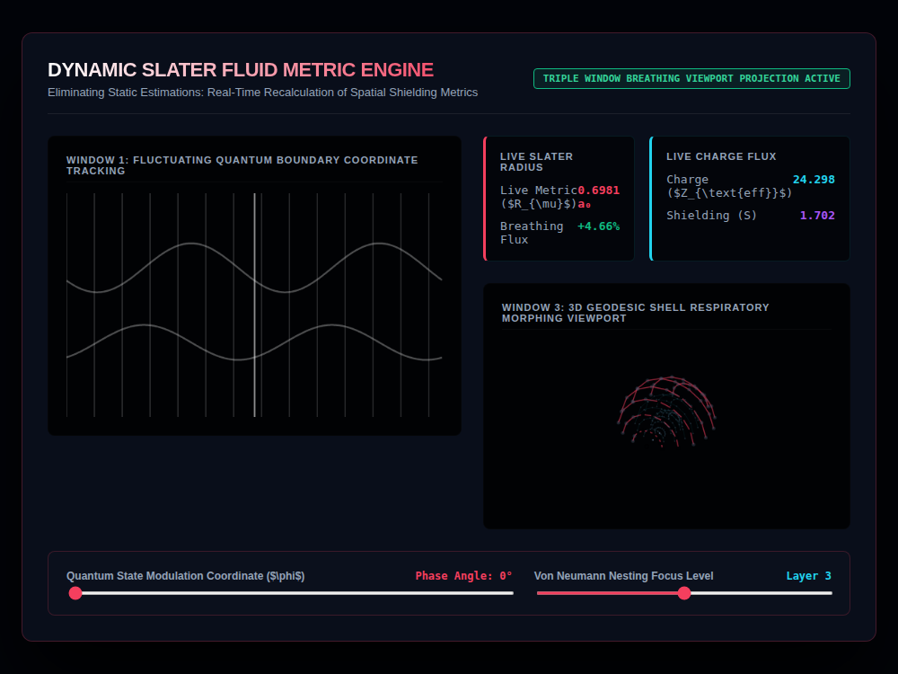

# 9x8_Torus_013.html — Dynamic Slater Quantum Engine: Triple-Window Suite

**Reference implementation:** [`9x8_Torus_013.html`](./9x8_Torus_013.html)
**Screenshot:** 

## What it demonstrates

A merge of two earlier threads: the animated Slater radius/Z_eff waveforms
from [`9x8_Torus_012.html`](./9x8_Torus_012.md) and the nested-shell 3D
lattice from [`9x8_Torus_006.html`](./9x8_Torus_006.md)–[`009`](./9x8_Torus_009.md),
now shown together in a **three-window layout** and linked so the same
oscillation drives both views — the 3D shell literally "breathes" (grows
and shrinks) in sync with the Slater radius waveform.

- **Window 1** — same dual sine/cosine waveform chart as release 012
  (Slater radius in magenta, Z_eff in cyan).
- **Window 2** — the numeric telemetry cards (Live Radius, Breathing Flux,
  Charge, Shielding), same values as 012.
- **Window 3 (new)** — a 3-shell cross-sectioned sphere (simpler than the
  5-shell versions in 006–009: fixed at 3 shells, 8 rings, 16 nodes/ring,
  always sliced at `y ≤ 5`). The **focused layer's radius is scaled live**
  by `1 + (radiusOscillation * 0.4)` — i.e. the same sine term computed for
  the Window 1 chart also physically resizes that shell in Window 3, so
  watching the chart's magenta wave predicts exactly when the shell will be
  expanded vs. contracted.
- **Breathing amplitude scales with layer depth**: `0.035 * (layer * 0.35 +
  0.65)`, so deeper (higher-numbered) layers breathe with slightly larger
  amplitude than shallower ones — a detail not present in 012's simpler
  single-window version.

## How the UI works

- **Quantum State Modulation Coordinate (φ) slider** and **Von Neumann
  Nesting Focus Level slider** (1–5) drive all three windows at once:
  phase shifts both waveforms and the shell's breathing rhythm; layer
  selection picks which of the 3 shells visibly expands/contracts and
  which ring gets the bright magenta highlight in Window 3.
- Continuous animation via `requestAnimationFrame`, same pattern as all
  prior shell/waveform releases.
- Same Canvas `var(--magenta-glow)` / `var(--cyan-glow)` CSS-variable
  quirk as every prior release using these accent tokens — stroke/fill
  colors relying on them don't resolve, so both waveforms and the shell
  wireframe render in fallback gray rather than the intended magenta/cyan
  (visible in the screenshot).

## What's in the screenshot

Captured mid-animation at the default load state (Phase 0°, Layer 3): Live
Radius 0.6981 a₀ (+4.66%), Z_eff 24.298, Shielding 1.702, with Window 3
showing the 3-shell cross-section and Layer 3's ring visibly enlarged
relative to its rest state.

---
*Part of the CORE reference series — unifies the waveform telemetry from
[`9x8_Torus_012.md`](./9x8_Torus_012.md) with the shell geometry from
[`9x8_Torus_006.md`](./9x8_Torus_006.md)–[`009`](./9x8_Torus_009.md).*
