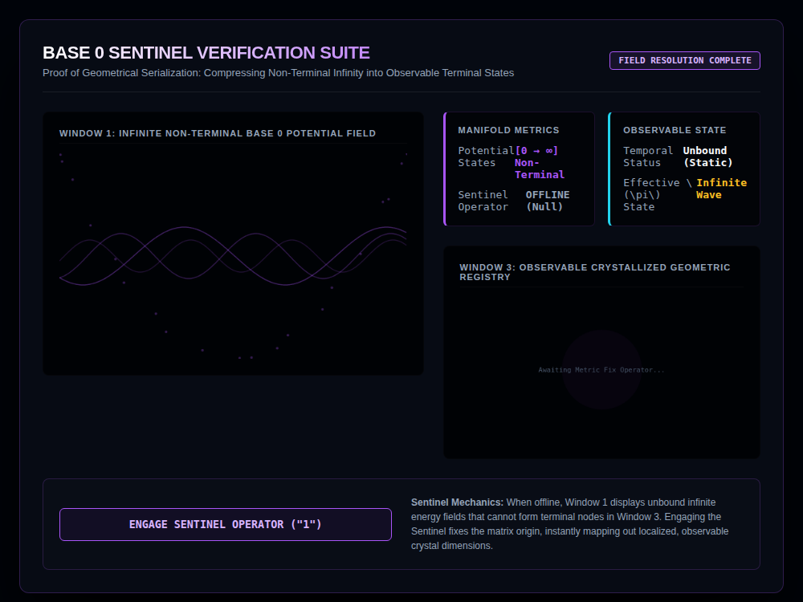
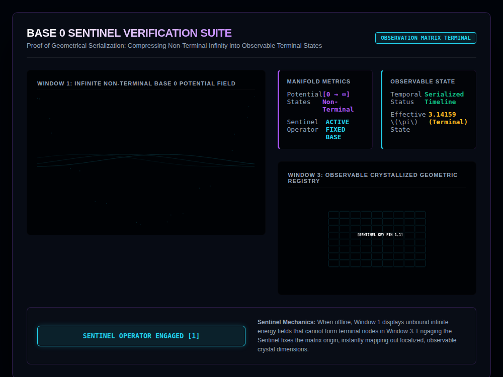

# 9x8_Torus_014.html — Base 0 Sentinel Information Suite

**Reference implementation:** [`9x8_Torus_014.html`](./9x8_Torus_014.html)
**Screenshots:**

## What it demonstrates

A conceptual reset from the shell/waveform releases: this one visualizes a
single toggle — the **"Sentinel Operator"** — that switches the whole
display between an unbounded, chaotic "potential field" and a crystallized,
discrete 9×8 coordinate grid anchored at a fixed origin. The framing is
explicitly philosophical/metaphorical ("Compressing Non-Terminal Infinity
into Observable Terminal States") rather than a physical simulation like
the chemistry-themed releases.

- **Sentinel OFF (default)** — Window 1 shows three overlapping noisy sine
  waves plus 20 drifting particles (an "unbound infinite potential field");
  Window 3 shows only a faint pulsing purple blob and the text "Awaiting
  Metric Fix Operator..." — no discrete grid exists yet.
- **Sentinel ON (button toggled)** — Window 1's waves calm to a single
  low-amplitude, low-frequency trace; Window 3 snaps into a crisp **9×8
  grid** of cyan nodes with wire connections, a magenta-highlighted origin
  node at `(0,0)` labeled `[SENTINEL KEY PIN 1,1]`, and the readouts switch
  from "Unbound (Static)" / "Infinite Wave" to "Serialized Timeline" /
  "3.14159 (Terminal)" — i.e. **fixing the origin is what makes π (and the
  grid itself) well-defined**, tying this release conceptually back to
  [`9x8_Matrix.html`](./9x8_Matrix.md)'s 9×8 = 72 grid and the
  `72 ≡ 0 (mod 72)` congruence used throughout the series.
- This is the first release in the CORE set to literally use the word
  "Sentinel" as its central concept — the fixed-origin operator that turns
  an undifferentiated field into the countable, addressable 9×8 lattice the
  rest of the series builds on.

## How the UI works

- **ENGAGE SENTINEL OPERATOR button** toggles `sentinelEngaged` and swaps
  all labels, colors, and both canvases' rendering logic between the two
  states described above.
- **Window 1** — procedurally animated noise/wave lines whose amplitude and
  frequency depend on the Sentinel state (chaotic and large when off,
  calm and small when on).
- **Window 3** — draws nothing (only ambient blur text) when off; draws an
  explicit 9-column × 8-row grid of horizontal/vertical lines and node dots
  when on, centered on the canvas with the origin node enlarged and colored
  differently from the rest.
- Continuous `requestAnimationFrame` animation loop drives both windows at
  all times, independent of the toggle.
- Same Canvas `var(--magenta-glow)` fill-color quirk as prior releases (the
  origin node's intended magenta fill doesn't resolve).
- No external libraries — self-contained HTML/canvas.

## What's in the screenshots

First capture: default load state, Sentinel offline — chaotic purple wave
field, no grid. Second capture: after clicking the toggle button — calm
wave, and the crystallized 9×8 grid with its highlighted origin pin
visible in Window 3.

---
*Part of the CORE reference series — reframes the 9×8 grid origin story
from [`9x8_Matrix.md`](./9x8_Matrix.md) as a discrete "Sentinel" fixed-point
operator.*
