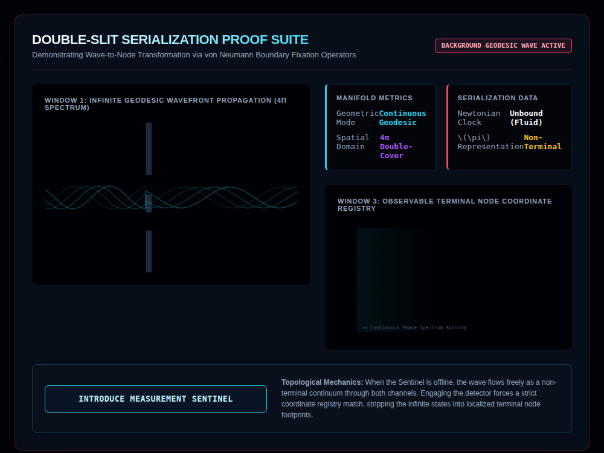
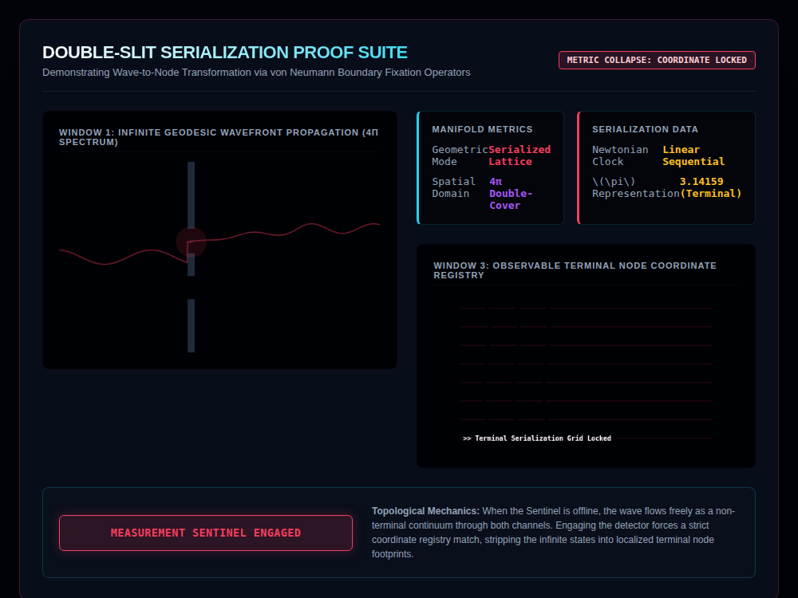

# 9x8_Torus_015.html — VNNT Double-Slit Serialization Suite

**Reference implementation:** [`9x8_Torus_015.html`](./9x8_Torus_015.html)
**Screenshots:**

## What it demonstrates

A direct continuation of [`9x8_Torus_014.html`](./9x8_Torus_014.md)'s
"Sentinel operator" toggle, now applied to the classic **double-slit
experiment** as a metaphor: an unobserved wave passes through both slits
and interferes (Window 1's overlapping sine traces, Window 3's cosine-based
interference-fringe curve); introducing a "Measurement Sentinel" collapses
the wave into a single localized path through one slit and snaps Window 3
into the same discrete 9×8-style row/column grid pattern used in release
014 — i.e. **measurement/observation is modeled as the same fixed-origin
operation that turned the chaotic field into the crystallized 9×8 lattice**
in the prior release.

- **Window 1 (offline)** — clean overlapping wave lines pass through both
  slit gaps in the barrier and recombine into an interference pattern past
  it (`wave1 + wave2`, summing contributions from both slit positions).
- **Window 1 (engaged)** — a single localized red pulse appears at the
  upper slit, and the trace afterward follows one specific path (a decaying
  blend toward the lower channel) rather than an interference sum —
  visualizing "which-path" information collapsing the wave.
- **Window 3 (offline)** — a smooth curve, `cos²(6·y)·cos(1.5·y)`, standing
  in for a multi-fringe interference intensity distribution.
- **Window 3 (engaged)** — 8 horizontal "channel bands" each with 3
  discrete red node points, replacing the continuous fringe curve with
  what the UI calls a "Terminal Serialization Grid."

## How the UI works

- **INTRODUCE MEASUREMENT SENTINEL button** toggles the same kind of
  before/after state swap as release 014's Sentinel button, relabeling all
  four telemetry values (Geometric Mode, Spatial Domain, Newtonian Clock,
  π Representation) and the global status badge between "unobserved wave"
  and "measured/collapsed" language.
- Both canvases animate continuously via `requestAnimationFrame`
  regardless of toggle state.
- Same Canvas `var(--magenta-glow)` fill-color quirk as prior releases.
- No external libraries — self-contained HTML/canvas 2D.

## What's in the screenshots

First capture: default load state, Sentinel offline — interference wave
passing both slits, smooth fringe curve in Window 3. Second capture: after
clicking the toggle — single collapsed path with a localization pulse at
the top slit, and Window 3's continuous curve replaced by the discrete
8-row × 3-node grid.

---
*Part of the CORE reference series — applies
[`9x8_Torus_014.md`](./9x8_Torus_014.md)'s Sentinel/fixed-origin concept to
a double-slit measurement metaphor.*
