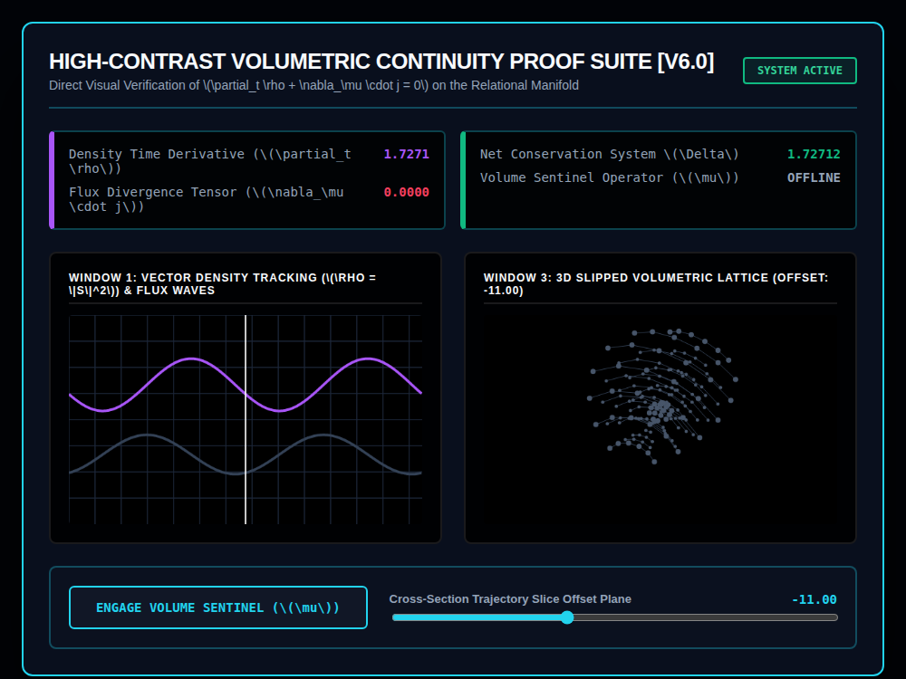
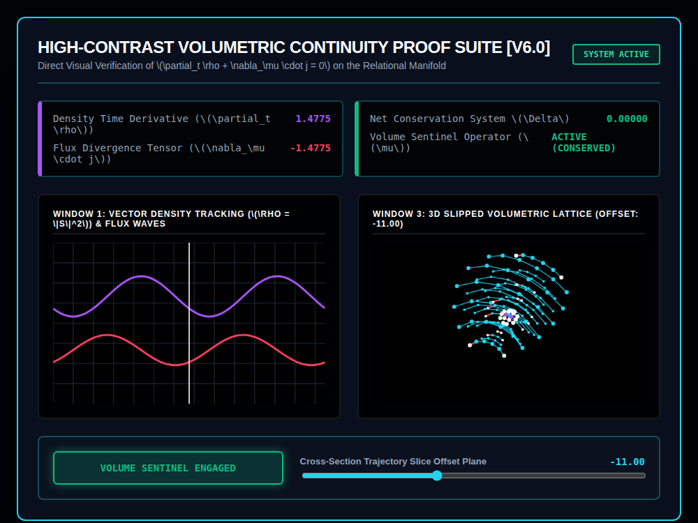

# 9x8_Torus_016.html — VNNT High-Visibility Continuity Laboratory (v6.0)

**Reference implementation:** [`9x8_Torus_016.html`](./9x8_Torus_016.html)
**Screenshots:**

## What it demonstrates

The third "Sentinel toggle" release (after
[`9x8_Torus_014.html`](./9x8_Torus_014.md) and
[`9x8_Torus_015.html`](./9x8_Torus_015.md)), now framed as a **direct
visual check of the continuity equation** `∂ₜρ + ∇·j = 0` — the physics law
stating that a conserved quantity's local rate of change must equal the
negative divergence of its flux. It also fixes the earlier releases' Canvas
`var(--accent)` color quirk: every color here is a literal hex string
(`#a855f7`, `#22d3ee`, etc.), so accent colors render exactly as intended —
matching the "High-Visibility"/"High-Contrast" framing in the title.

- **Density Time Derivative (∂ₜρ)** — a cosine wave, `1.85·cos(2·clock)`,
  representing how fast the tracked quantity is changing.
- **Flux Divergence Tensor (∇·j)** — when the Sentinel is **off**, this is
  hardcoded to `0.0000` regardless of the density rate, so the two terms
  don't balance and **Net Conservation Δ equals the density rate itself**
  (non-zero — conservation "violated"). When the Sentinel is **engaged**,
  divergence is set to the exact negative of the density rate
  (`-densityRate`), making **Net Conservation Δ exactly 0.00000** — the
  continuity equation now holds by construction, illustrated as "ACTIVE
  (CONSERVED)."
- **Window 3** reuses the 5-shell lattice-with-cross-section approach from
  releases 006–013 (8 rings × 14 nodes/shell here), recolored: cyan
  channel framework when the Sentinel is active, muted slate/gray when
  inactive, with the cut-plane rim highlighted white.

## How the UI works

- **ENGAGE VOLUME SENTINEL (μ) button** — same on/off toggle pattern as
  014/015, this time visibly changing Window 3's line/node colors from
  slate to vivid cyan/magenta/white rather than a structural change to the
  geometry itself (the shell cross-section is generated the same way in
  both states; only its styling and the flux-divergence math differ).
- **Cross-Section Trajectory Slice Offset slider** (-50 to 50, default -11)
  works the same as the shell releases' slice sliders, cutting the 5-shell
  sphere open; specific `(sliceVal, layerIndex)` combinations
  (`-11` + layer 1, `-50` + layer 5) get bespoke purple/amber highlight
  colors called out as "Square Core" and "Hexagon Valence" alignment
  points — Easter-egg-style special cases rather than a general rule.
- Continuous animation via `requestAnimationFrame`, same as the rest of the
  series.
- No external libraries — self-contained HTML/canvas 2D.

## What's in the screenshots

First capture: default load state, Sentinel offline — Density Rate 1.7271,
Divergence 0.0000, Net Δ 1.72712 (unconserved), lattice in dim slate.
Second capture: after engaging the Sentinel — Density Rate 1.4775,
Divergence -1.4775, Net Δ 0.00000 (conserved), lattice recolored bright
cyan/white.

---
*Part of the CORE reference series — extends the Sentinel toggle concept
from [`9x8_Torus_014.md`](./9x8_Torus_014.md)/[`015`](./9x8_Torus_015.md)
to a continuity-equation framing, and is the first release where the
Canvas CSS-variable color bug from releases 004–015 is fixed.*
