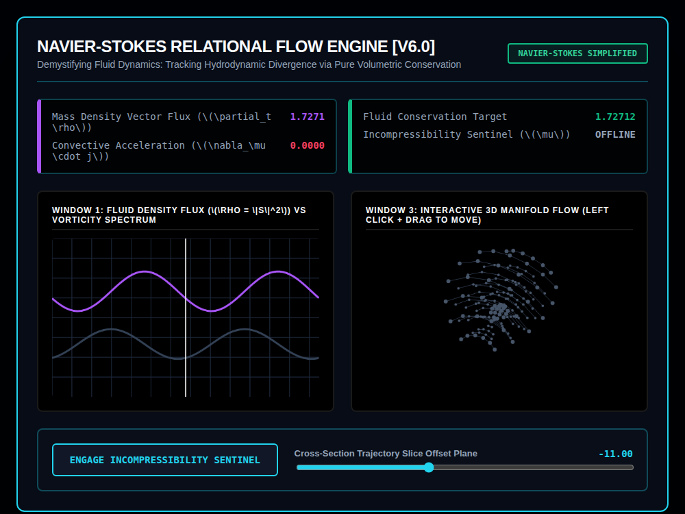

# 9x8_Torus_017.html — VNNT Navier-Stokes Continuity Lab [v6.0]

**Reference implementation:** [`9x8_Torus_017.html`](./9x8_Torus_017.html)
**Screenshot:** 

## What it demonstrates

A relabeling and interactivity pass on
[`9x8_Torus_016.html`](./9x8_Torus_016.md): identical math and layout
(same `densityRate = 1.85·cos(2·clock)`, same Sentinel on/off logic making
Net Δ collapse to exactly 0, same 5-shell/8-ring/14-node lattice with
cross-section slicing), but reframed in **fluid-dynamics vocabulary**
(Navier-Stokes, mass density flux, convective acceleration,
incompressibility) instead of 016's generic continuity-equation framing —
the underlying `∂ₜρ + ∇·j = 0` check is the same physics either way, just
described as "incompressibility" here.

- **Renamed telemetry**: "Density Time Derivative" → "Mass Density Vector
  Flux," "Flux Divergence Tensor" → "Convective Acceleration," "Net
  Conservation Δ" → "Fluid Conservation Target," "Volume Sentinel" →
  "Incompressibility Sentinel." The numbers and formulas behind them are
  unchanged from 016.
- **New: draggable Window 3** — this release adds mouse-drag rotation to
  the 3D lattice viewport (`mousedown`/`mousemove` updating `rotX`/`rotY`),
  which 016 did not have (016 used a fixed viewing angle). This is the main
  functional addition over 016.

## How the UI works

Same as [`9x8_Torus_016.html`](./9x8_Torus_016.md) — Sentinel toggle
button, Cross-Section Slice Offset slider, continuous animation — plus
click-and-drag rotation on the Window 3 canvas (cursor changes to
"grabbing" while dragging).

## What's in the screenshot

Captured at the default load state, Sentinel offline: Mass Density Flux
1.7271, Convective Acceleration 0.0000, Fluid Conservation Target 1.72712
(unconserved) — same numeric pattern as 016's offline state, confirming
the underlying math is unchanged.

---
*Part of the CORE reference series — a fluid-dynamics relabeling of
[`9x8_Torus_016.md`](./9x8_Torus_016.md) with added drag-to-rotate
interactivity.*
