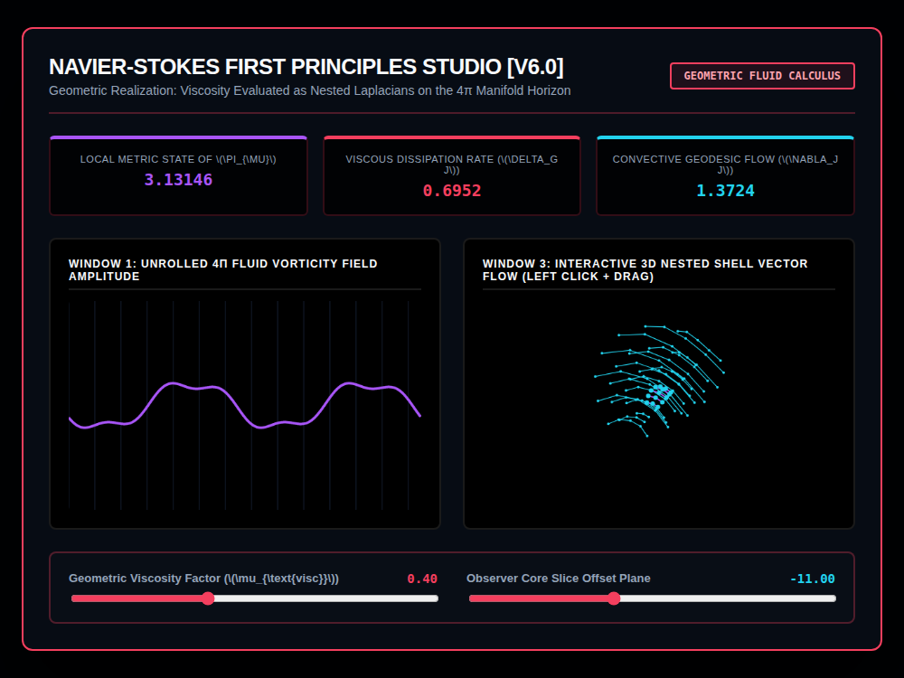

# 9x8_Torus_018.html — Navier-Stokes First Principles Laboratory [v6.0]

**Reference implementation:** [`9x8_Torus_018.html`](./9x8_Torus_018.html)
**Screenshot:** 

## What it demonstrates

Builds on the Navier-Stokes framing from
[`9x8_Torus_017.html`](./9x8_Torus_017.md) by adding a real, continuously
adjustable **viscosity parameter** that — unlike prior releases' mostly
color/labeling changes — actually deforms the 3D shell mesh's geometry
live, not just its telemetry numbers. This is also the first release to
drop the on/off Sentinel toggle in favor of a single continuous slider
driving everything.

- **Geometric Viscosity Factor slider** (0.05–1.00): high viscosity damps
  turbulent wave amplitude and vertex displacement (a "thick, calm fluid");
  low viscosity permits larger, sharper shear turbulence.
- **Three live formulas**, all functions of viscosity and a running clock:
  - **Local π (πμ)** — drifts from 3.14159 by up to ±1.5%, more at low
    viscosity: `π·(1 − 0.015·sin(2·clock)·(1−viscosity))`.
  - **Viscous Dissipation Rate** — scales *up* with viscosity:
    `4.85·viscosity·sin(2·clock)`, i.e. thicker fluid dissipates energy
    faster.
  - **Convective Geodesic Flow** — scales *down* with viscosity:
    `2.45·(1−viscosity)·cos(2·clock)`, i.e. thinner fluid convects more
    freely. The two rates are complementary by construction (one rises as
    the other falls).
- **Window 3's mesh vertices are physically displaced** by a shear term
  (`dynamicDisplacement`) proportional to `(1 − viscosity)`, so dragging
  the viscosity slider visibly firms up or loosens the shell shape itself,
  not just its color — a first for the series (prior "flow" visualizations
  only recolored a fixed geometry).
- Nodes/edges with velocity magnitude above a threshold light up in bright
  magenta/white, marking the most turbulent parts of the mesh at any given
  moment.

## How the UI works

- **Geometric Viscosity Factor** and **Observer Core Slice Offset Plane**
  sliders (the latter working like prior releases' cross-section sliders,
  now on a 4-shell/8-ring/12-node mesh) drive `executeFluidCalculus()`.
- **Window 3 is draggable** (click + drag to rotate), same interaction
  pattern introduced in release 017.
- Continuous `requestAnimationFrame` animation, same as the rest of the
  series. All colors are literal hex strings (no CSS-variable quirk, same
  fix as releases 016–017).
- No external libraries — self-contained HTML/canvas 2D.

## What's in the screenshot

Captured at the default load state: Viscosity 0.40, Slice -11.00 — Local π
3.13146, Viscous Dissipation 0.6952, Convective Flow 1.3724, with the 3D
mesh showing moderate shear turbulence (visible waviness) at this
mid-range viscosity setting.

---
*Part of the CORE reference series — extends
[`9x8_Torus_017.md`](./9x8_Torus_017.md) with a continuous viscosity
parameter that physically deforms the shell geometry.*
