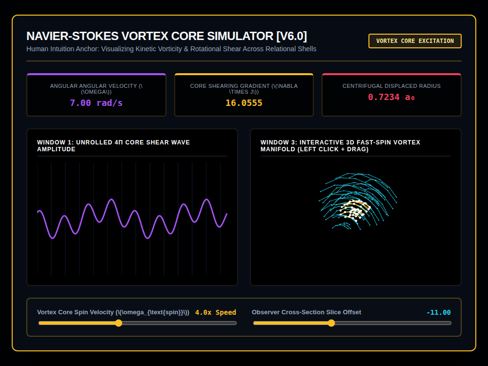

# 9x8_Torus_019.html — Navier-Stokes Vortex Core Simulator [v6.0]

**Reference implementation:** [`9x8_Torus_019.html`](./9x8_Torus_019.html)
**Screenshot:** 

## What it demonstrates

Where [`9x8_Torus_018.html`](./9x8_Torus_018.md) deformed the shell mesh
uniformly by viscosity, this release introduces **differential rotation**:
inner shells spin visibly faster than outer shells, the way a real vortex
core (a tornado, a whirlpool, a spinning star) rotates faster near its
center. The title calls this a "Human Intuition Anchor" — a more
physically familiar visualization than the abstract dissipation/convection
numbers of 018.

- **Layer-dependent spin rate**: `layerShearVelocity = angularRotationOffset
  * (8 / (layer + 1))`, added directly to each node's longitude angle — so
  layer 1 (innermost) rotates roughly 4x faster than layer 4, and so on.
  This is what makes the inner shells visibly spiral ahead of the outer
  ones frame to frame.
- **Centrifugal radial expansion**: inner shells also push outward
  slightly more than outer ones (`radialExpansion` scales with `1/layer`),
  modeling the outward force of fast rotation.
- **Three live readouts**: Angular Velocity (`ω = spin × 1.75` rad/s), Core
  Shearing Gradient (`spin × 3.42 × (1 + sin(clock))`, i.e. how sharply
  adjacent shells' rotation rates differ), and Centrifugal Displaced Radius
  (oscillates around the familiar 0.667 a₀ Slater-radius baseline from
  earlier releases, now scaled up by spin speed).
- The two innermost shells (layer ≤ 2) are highlighted in amber/white when
  spinning, visually marking the "vortex core" as distinct from the calmer
  outer "valence buffer" shells (cyan).

## How the UI works

- **Vortex Core Spin Velocity slider** (0–10x) is the primary control —
  it drives the differential rotation rate, the radial expansion, the
  vorticity/angular-velocity readouts, and the Window 1 waveform's spiral
  harmonic complexity all at once.
- **Observer Cross-Section Slice Offset slider** works as in prior shell
  releases, cutting the 5-shell/10-ring/14-node mesh open.
- Draggable Window 3 (click + drag to rotate), continuous
  `requestAnimationFrame` animation — same interaction pattern as releases
  017–018. All colors are literal hex (no CSS-variable quirk).
- No external libraries — self-contained HTML/canvas 2D.

## What's in the screenshot

Captured at the default load state: Spin 4.0x, Slice -11.00 — Angular
Velocity 7.00 rad/s, Core Shearing Gradient 16.0555, Centrifugal Radius
0.7234 a₀, with the inner two shells visibly spun ahead of (and expanded
relative to) the outer shells, highlighted in amber/white.

---
*Part of the CORE reference series — adds differential (core-vs-shell)
rotation to the viscosity mesh introduced in
[`9x8_Torus_018.md`](./9x8_Torus_018.md).*
