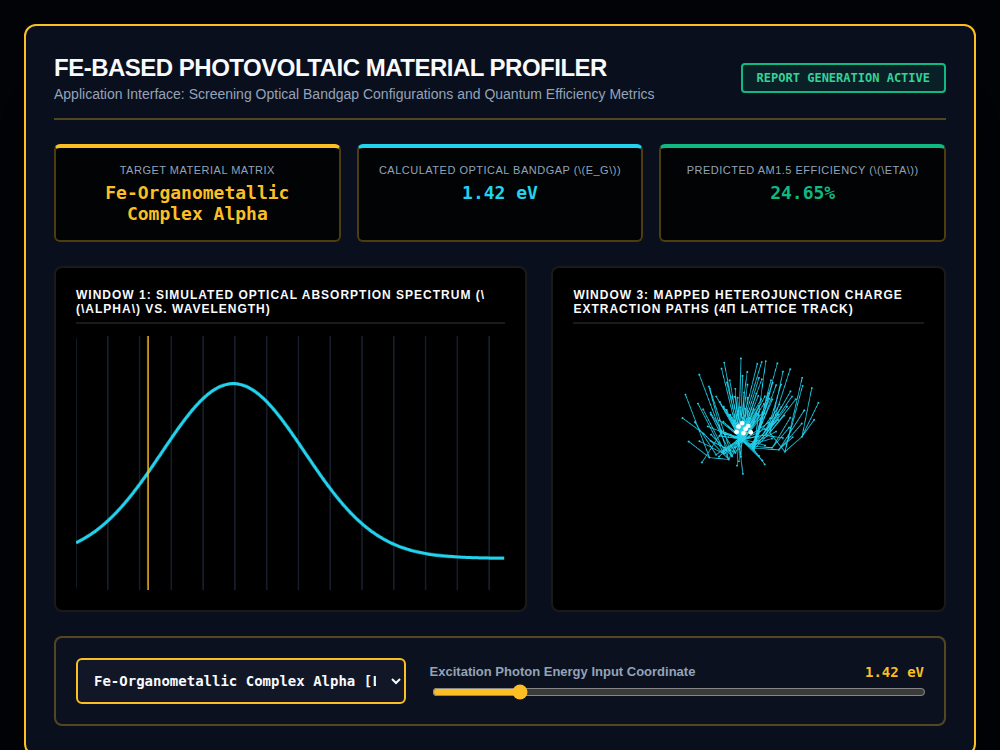

# 9x8_Torus_020.html — Fe-Based Photovoltaic Absorption Profiler [v6.0]

**Reference implementation:** [`9x8_Torus_020.html`](./9x8_Torus_020.html)
**Screenshot:** 

## What it demonstrates

A pivot from "physics demo" to "application": this release repackages the
5-shell lattice engine as a **material-screening tool** for iron-based
photovoltaic absorbers, complete with a material picker, a simulated
absorption spectrum, and headline efficiency numbers — the first release
in the series styled like a product/lab-report interface rather than a
pure visualization.

- **Material dropdown** — 3 hardcoded materials (Fe-Organometallic Complex
  Alpha, Fe-Doped Perovskite Polymorph Beta, Fe-Sulfide Quantum Dot Hybrid
  Gamma), each with a fixed bandgap, efficiency %, peak absorption
  wavelength, and an associated "focus shell" (1, 3, or 5) in the 3D
  lattice.
- **Window 1** — a Gaussian absorption curve centered on the selected
  material's peak wavelength, with a vertical amber line marking the
  **Excitation Photon Energy slider**'s current position (1.00–3.50 eV) —
  letting you visually compare the input photon energy against where the
  material actually absorbs.
- **Window 3** — the shell lattice's "focus" shell (tied to the selected
  material) pulses outward proportionally to `inputEnergy / bandgap`, i.e.
  the closer the excitation energy is to (or above) the material's bandgap,
  the more pronounced the pulse — a rough stand-in for "how strongly this
  photon energy excites carriers in this material."
- **Different connectivity rule than prior shell releases**: instead of
  wiring each node to its ring/longitude neighbor by index, this release
  connects each node to the nearest other node of the same shell **by
  on-screen X position and greater depth**
  (`Math.abs(o.x - p.x) < 40 && o.depth > p.depth`) — producing the
  radiating, sunburst-like line pattern visible in the screenshot rather
  than the smooth ring-wire pattern used in releases 006–019.

## How the UI works

- **Material dropdown** and **Excitation Photon Energy slider** both call
  `updateMaterialProfile()`, updating the three telemetry cards (Target
  Material, Bandgap, Efficiency), the spectrum curve/marker, and the 3D
  lattice's pulsing focus shell together.
- Fixed viewing angle in Window 3 (no drag-to-rotate in this release,
  unlike 017–019) and a fixed cross-section cut at `y ≤ -11 × 1.6`.
- Continuous `requestAnimationFrame` animation for the pulse effect. All
  colors are literal hex (no CSS-variable quirk).
- No external libraries — self-contained HTML/canvas 2D.

## What's in the screenshot

Captured at the default load state: Fe-Organometallic Complex Alpha
selected, Bandgap 1.42 eV, Efficiency 24.65%, excitation energy 1.42 eV
(the amber marker sits near the curve's left shoulder rather than its
peak, since peak absorption is keyed to wavelength/520nm rather than
directly to the bandgap value) — Window 3 shows shell 1 (this material's
focus shell) radiating outward from the lattice core.

---
*Part of the CORE reference series — repurposes the shell-lattice engine
from [`9x8_Torus_006.md`](./9x8_Torus_006.md) onward as an applied
materials-screening interface.*
