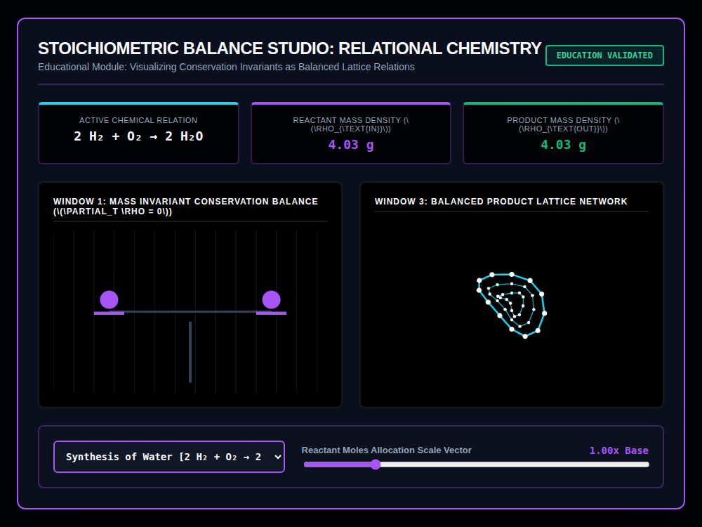

# 9x8_Torus_021.html — VNNT Stoichiometric Balance Studio [Educational Module]

**Reference implementation:** [`9x8_Torus_021.html`](./9x8_Torus_021.html)
**Screenshot:** 

## What it demonstrates

Explicitly labeled "Educational Module," this release turns the series'
conservation-law theme into a **balanced chemical equation visualizer** —
a direct precursor to the standalone Stoichiometry Solver built later for
this project. It picks a real reaction, shows both sides' equation and
total mass, and animates a literal balance-scale to make conservation of
mass visually obvious.

- **3 reactions**: Synthesis of Water (`2 H₂ + O₂ → 2 H₂O`), Oxidation of
  Iron/Rust (`4 Fe + 3 O₂ → 2 Fe₂O₃`), Synthesis of Pyrite (`Fe + 2 S →
  FeS₂`) — each with a fixed total reactant/product mass (equal by
  construction, since these are already-balanced equations) and a distinct
  ring-count/point-count/color for Window 3's lattice.
- **Window 1** — a simple balance-scale drawing: a horizontal beam on a
  central pillar with a weight on each side, sized by the moles multiplier
  and gently bobbing. Because reactant and product mass are set equal in
  the data, **the beam stays level regardless of the multiplier** — the
  visual payoff being "conservation holds at any scale," reinforced by the
  `∂ₜρ = 0` (mass doesn't change over time) label.
- **Window 3** — a flat, ring-based "product lattice" (not a 3D shell this
  time — nodes lie on a 2D plane with a small sinusoidal Z-wobble for
  visual depth) whose ring count and point count vary by reaction (Water:
  3 rings × 12 points; Rust: 5×16; Pyrite: 4×14), color-coded per reaction.
- **Reactant Moles Allocation Scale slider** (0.5x–3.0x) scales both masses
  proportionally and pulses the lattice/scale weights larger — demonstrating
  that scaling a balanced equation by any factor keeps it balanced.

## How the UI works

- **Reaction dropdown** switches the whole profile (equation text, masses,
  lattice shape/color) and resets the moles slider to 1.00x.
- **Moles slider** rescales masses and visual pulse size live.
- The whole render function is wrapped in a `try/catch` (a first for the
  series — `recalculateStoichiometry()` logs to console rather than
  throwing on error), suggesting this release was hardened against runtime
  errors more deliberately than earlier ones.
- One CSS-variable color quirk reappears here (absent in 016–020): the
  balance beam and right-side weight use `strokeStyle/fillStyle =
  'var(--green-glow)'`, which Canvas 2D doesn't resolve, so the right
  weight renders in the same purple as the left one instead of green
  (visible in the screenshot — both balance weights are purple).
- Continuous `requestAnimationFrame` animation. No external libraries —
  self-contained HTML/canvas 2D.

## What's in the screenshot

Captured at the default load state: Synthesis of Water selected, both
Reactant and Product Mass Density at 4.03 g, moles multiplier 1.00x — a
level balance beam and the 3-ring cyan "Water Matrix" lattice.

---
*Part of the CORE reference series — the conservation-law visualization
this series has explored since [`9x8_Torus_016.md`](./9x8_Torus_016.md),
applied directly to balanced chemical equations as an educational tool.*
