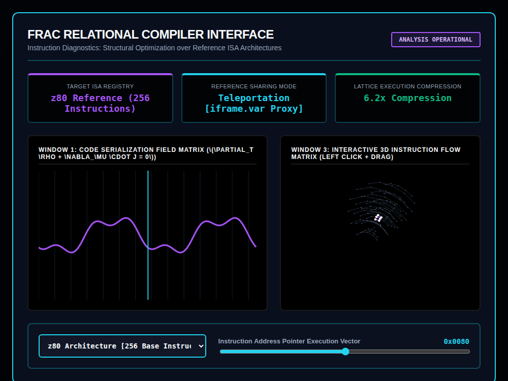

# 9x8_Torus_022.html — FRAC Relational Compiler Profiler [v6.0]

**Reference implementation:** [`9x8_Torus_022.html`](./9x8_Torus_022.html)
**Screenshot:** 

## What it demonstrates

Another "applied" skin over the same shell-lattice engine, this time
framed as a **compiler/instruction-set-architecture diagnostics tool**
("FRAC Relational Compiler") — following the same template as
[`9x8_Torus_020.html`](./9x8_Torus_020.md)'s photovoltaic profiler and
[`9x8_Torus_021.html`](./9x8_Torus_021.md)'s chemistry studio: a dropdown
selecting between named profiles, a telemetry strip, a 2D signal window,
and the familiar 5-shell/8-ring/12-node 3D lattice with one shell pulsing
to mark the active selection.

- **3 ISA profiles**: z80 (256 instructions, shell 1 active), RISC Core
  (shell 3 active), ARM Variable Set (shell 5 active) — each with its own
  compression-speedup figure (6.2x / 4.8x / 8.1x) and highlight color
  (purple / cyan / amber).
- **Instruction Address Pointer slider** (0–255) is displayed as a hex
  address (`0x00FF`-style, zero-padded to 4 hex digits despite the value
  never exceeding `0xFF`) and drives a scanning marker line across
  Window 1's wave, echoing the "excitation energy" marker pattern from
  release 020.
- **"Reference Sharing Mode: Teleportation [iframe.var Proxy]"** — a fixed
  telemetry card with no slider or dropdown tied to it; it doesn't change
  with any control in this release, functioning as flavor text rather than
  a live readout.
- Window 1's title carries the `∂ₜρ + ∇·j = 0` continuity equation from
  releases 016–020, reused here as thematic continuity even though this
  release's content (an instruction-density curve) isn't a literal density/
  flux calculation.

## How the UI works

- **ISA dropdown** and **Instruction Pointer slider** drive
  `processCompilationDiagnostics()`, wrapped in the same `try/catch`
  guard pattern introduced in release 021.
- **Window 3 is draggable** (click + drag to rotate), continuing the
  interactivity from releases 017–020's shell viewports.
- Continuous `requestAnimationFrame` animation. All colors are literal hex
  (no CSS-variable quirk).
- No external libraries — self-contained HTML/canvas 2D.

## What's in the screenshot

Captured at the default load state: z80 Architecture selected (256
instructions, 6.2x compression), pointer at `0x0080` (slider default 128)
— shell 1 pulsing white/purple as the active layer, with the Window 1 scan
line positioned near the chart's center.

---
*Part of the CORE reference series — a third "applied profiler" skin over
the shell engine, following
[`9x8_Torus_020.md`](./9x8_Torus_020.md)/[`021`](./9x8_Torus_021.md).*
