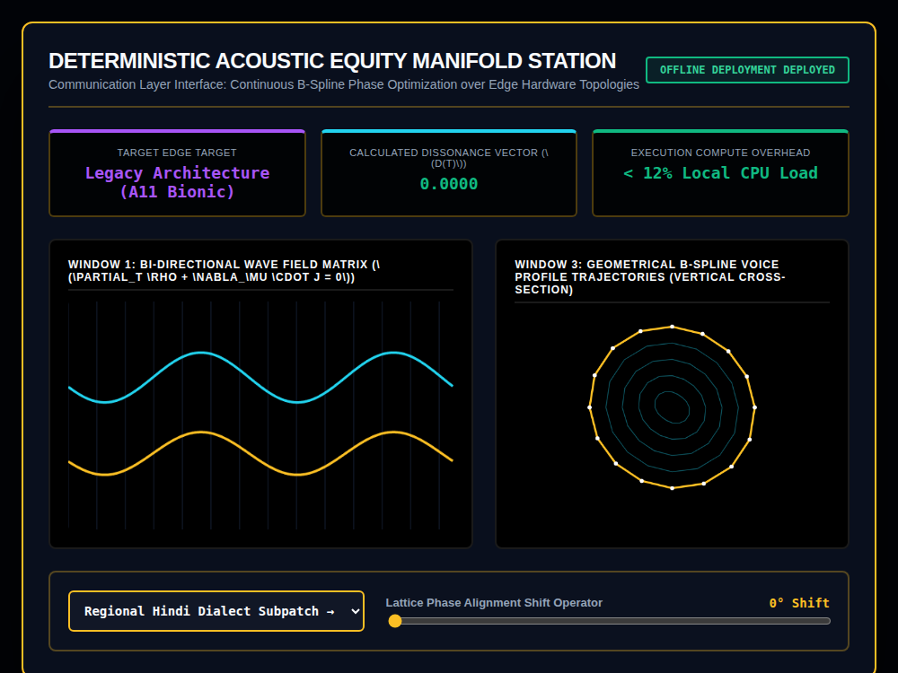

# 9x8_Torus_023.html — Acoustic Equity Manifold Station [v6.0-Deterministic]

**Reference implementation:** [`9x8_Torus_023.html`](./9x8_Torus_023.html)
**Screenshot:** 

## What it demonstrates

A fourth "applied profiler" skin (after
[`020`](./9x8_Torus_020.md)/[`021`](./9x8_Torus_021.md)/[`022`](./9x8_Torus_022.md)),
this one framed around **accessible, offline voice/dialect translation on
older edge hardware** — the "equity" in the title referring to running
locally on legacy devices (the telemetry card names "Legacy Architecture
(A11 Bionic)," the chip in iPhone 8/X-era hardware) rather than requiring
cloud compute, so translation stays available on hardware people already
own.

- **2 dialect profiles**: "Regional Hindi Dialect Subpatch → Standard
  Translation" and "Italian Familial Nonna Patch → English Superposition"
  — each with its own accent color and spline frequency, suggesting a
  concept of small, per-dialect/per-speaker "patches" layered onto a base
  translation model.
- **Calculated Dissonance Vector D(t)** — `|sin(phaseShift) × 0.45|`,
  framed as "how far out of phase the translated output is from the
  input," reading exactly 0 (green, "Phase Aligned") only when the Lattice
  Phase Alignment slider sits at 0° or a multiple of 180°.
- **Window 1** shows two waveforms — a fixed cyan "input" wave and a
  colored "output" wave whose phase is offset by the slider's shift angle —
  visualizing translation as a phase-shift between input and output signal,
  consistent with the Dissonance metric.
- **Window 3** — a 2D (not 3D) set of 5 concentric rings, warped by both
  the phase slider and a per-profile spline frequency, framed as "B-Spline
  Voice Profile Trajectories." This is the first shell-style visualization
  in the series presented as a genuinely flat cross-section rather than a
  3D-to-2D projection.

## How the UI works

- **Dialect dropdown** and **Phase Alignment slider** (0–360°) drive
  `processAcousticManifold()`, wrapped in the same `try/catch` guard
  pattern as releases 021–022; switching dialects resets the phase slider
  to 0° (zero-dissonance baseline).
- Continuous `requestAnimationFrame` animation. All colors are literal hex
  (no CSS-variable quirk).
- No external libraries, no actual audio processing — this is a purely
  visual/numeric mock-up of the concept, not a working translation engine.

## What's in the screenshot

Captured at the default load state: Hindi Subpatch selected, Phase Shift
0° (Dissonance 0.0000, phase-aligned, green) — the cyan input wave and
amber output wave perfectly in phase, and Window 3's 5 rings undistorted
concentric circles at this zero-shift setting.

---
*Part of the CORE reference series — a fourth applied-domain skin over the
shell/wave engine, extending
[`9x8_Torus_020.md`](./9x8_Torus_020.md)–[`022`](./9x8_Torus_022.md) into
accessible on-device speech translation.*
