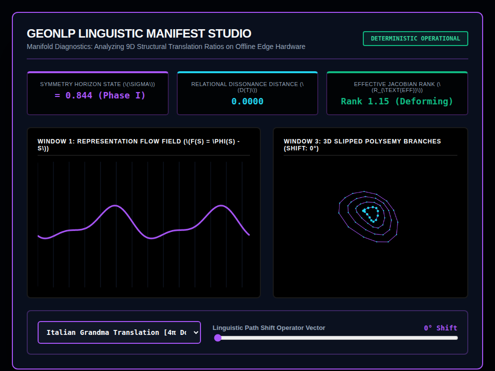

# 9x8_Torus_024.html — GeoNLP Linguistic Manifest Studio [v6.0]

**Reference implementation:** [`9x8_Torus_024.html`](./9x8_Torus_024.html)
**Screenshot:** 

## What it demonstrates

A refinement of [`9x8_Torus_023.html`](./9x8_Torus_023.md)'s acoustic
translation concept into explicitly **NLP/representation-learning**
vocabulary: instead of "voice patches" and acoustic dissonance, this
release frames the same dropdown + phase-shift structure as tracking a
"representation flow field" `F(S) = φ(S) − S` (a standard way to describe
how a learned transformation φ moves a point S in embedding space) across
translation "manifolds" for two example language contexts.

- **2 profiles**: "Italian Grandma Translation [4π Double-Cover Arm]" and
  "Rural India Cognitive Stream [Lasagna Limit Axis]" — playful/informal
  names for what are presented as distinct linguistic representation
  manifolds, each with its own ring/point count and highlight color.
- **Three telemetry values**, all continuously animated:
  - **Symmetry Horizon State (σ)** — starts near the profile's baseline
    (0.842 or 0.985) and drifts slightly; crossing 0.9 flips its label from
    "Phase I" to "Lasagna Limit."
  - **Relational Dissonance Distance D(t)** — `|sin(shift) × 0.35|`, same
    shape as release 023's dissonance metric, zero only at 0°/180°/360°
    shift.
  - **Effective Jacobian Rank** — drifts toward "Collapsed" (< 1.1) or
    "Deforming" depending on the clock and shift slider; a Jacobian rank
    near 1 is a real way to describe a transformation that's nearly
    degenerate/low-dimensional at a point.
- **Window 3** — a 2D concentric-ring diagram similar to release 023's
  B-splines, but here the innermost ring ("layer 1") visibly shifts
  sideways as the **Linguistic Path Shift Operator** slider increases,
  and turns magenta/white — framed as a "polysemous branch fork," i.e. one
  meaning of a word splitting off from the rest as translation ambiguity
  increases.

## How the UI works

- **Dialect dropdown** and **Path Shift slider** (0–360°) drive
  `processLinguisticManifold()`, same `try/catch`-guarded pattern as
  021–023; switching profiles resets the shift slider to 0°.
- **Window 3 is draggable**, though its mouse-move handler has a small
  bug — it references `e.mousemove` (not a real event property, evaluates
  to `undefined`) when computing an unused `deltaY` variable; the actual
  rotation update uses `e.clientY - lastMouseY` directly on the next line,
  so the bug has no visible effect on the rendered rotation.
- Continuous `requestAnimationFrame` animation. All colors are literal hex
  (no CSS-variable quirk).
- No external libraries, no real NLP model — a conceptual visualization,
  not a working translation system.

## What's in the screenshot

Captured mid-animation at the default load state: Italian Grandma profile,
0° shift — Symmetry σ = 0.844 (Phase I), Dissonance 0.0000 (aligned), Rank
1.15 (Deforming), with Window 3's 4 concentric rings and the innermost
(cyan, unshifted at 0°) ring centered.

---
*Part of the CORE reference series — reframes
[`9x8_Torus_023.md`](./9x8_Torus_023.md)'s acoustic translation concept in
NLP/representation-learning terms.*
