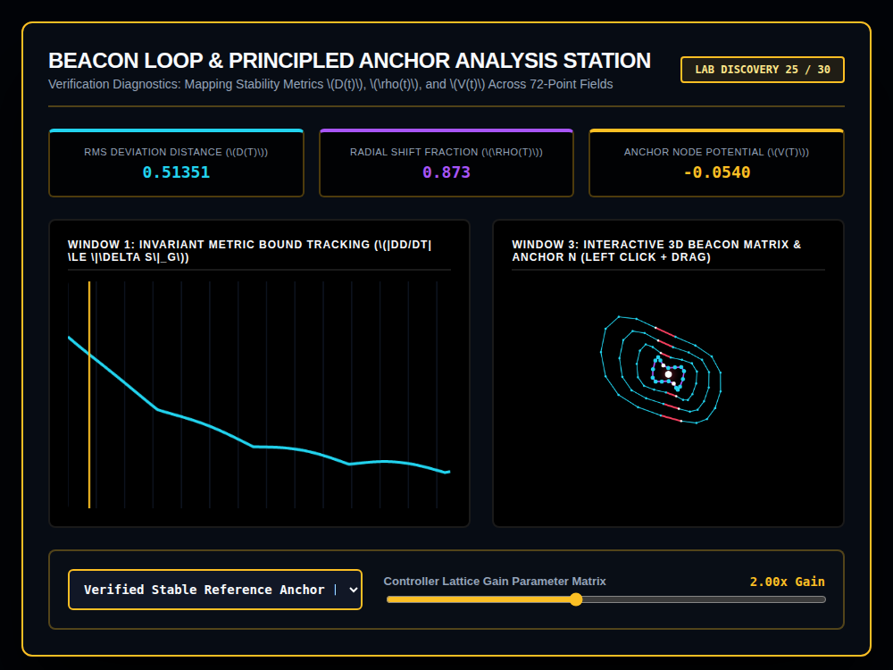

# 9x8_Torus_025.html — VNNT Beacon Loop Presentation Suite [Lab 25]

**Reference implementation:** [`9x8_Torus_025.html`](./9x8_Torus_025.html)
**Screenshot:** 

## What it demonstrates

Labeled "Lab Discovery 25/30" — an explicit checkpoint marker in the
series — this release returns to abstract verification/control-theory
language: a "Beacon Loop" of 72 points (4 shells × 18 beacons) orbiting a
fixed **Principled Anchor N**, with three stability metrics tracked over
time: RMS Deviation Distance `D(t)`, Radial Shift Fraction `ρ(t)`, and
Anchor Node Potential `V(t)`.

- **D(t)** decays exponentially from ~0.542 toward a floor of 0.012, with
  small oscillation layered on top — visualized directly in Window 1 as a
  decaying curve, framed as bounding `|dD/dt| ≤ ‖ΔS‖_g` (a Lipschitz-type
  stability bound: the system's drift rate is capped by how far it's
  perturbed).
- **72-point field**: 4 concentric shells × 18 beacons per shell = 72,
  tying back to the `9x8 = 72` count used throughout the series, now
  arranged radially rather than in a 9×8 grid or spherical shells.
- **Anchor region beacons** (index 4 and 13 in each ring) are highlighted
  in magenta as "fixed point equilibrium fields," and a single white pin
  glowing at the exact canvas center represents the Principled Anchor N
  itself.
- **Controller Lattice Gain slider** (0.5x–4.0x) damps the polarization
  warp applied to beacon positions and slightly affects D(t)'s and ρ(t)'s
  oscillation amplitude.

## How the UI works

- **Anchor Profile dropdown** ("Verified Stable Reference Anchor" /
  "Perturbed Polarized Reference") is present but **has no effect on the
  visualization** — its select element's id is `anchorSelect`, but the
  script reads `document.getElementById('reactionSelect')` (a leftover
  reference from [`9x8_Torus_021.html`](./9x8_Torus_021.md)'s reaction
  dropdown, which used that id), so the resulting `anchorSelect` variable
  is `null` and is never read by `processAnchorDiagnostics()` at all —
  switching the dropdown option changes nothing on screen. This is a real
  wiring bug carried from a copy-pasted release, not an intentional
  no-op control.
- **Controller Gain slider** is the only control that actually changes the
  render, along with the continuous animation clock.
- **Window 3 is draggable** (click + drag), same pattern as recent
  releases.
- Continuous `requestAnimationFrame` animation. All colors are literal hex
  (no CSS-variable quirk).
- No external libraries — self-contained HTML/canvas 2D.

## What's in the screenshot

Captured at the default load state: "Verified Stable Reference Anchor"
selected (though inert per above), Gain 2.00x — D(t) 0.51351, ρ(t) 0.873,
V(t) -0.0540, with the 4-shell beacon lattice and its magenta anchor-region
spokes visible around the central white pin.

---
*Part of the CORE reference series, marked "Lab Discovery 25/30" — a
checkpoint release; note the inert anchor-profile dropdown (see above).*
