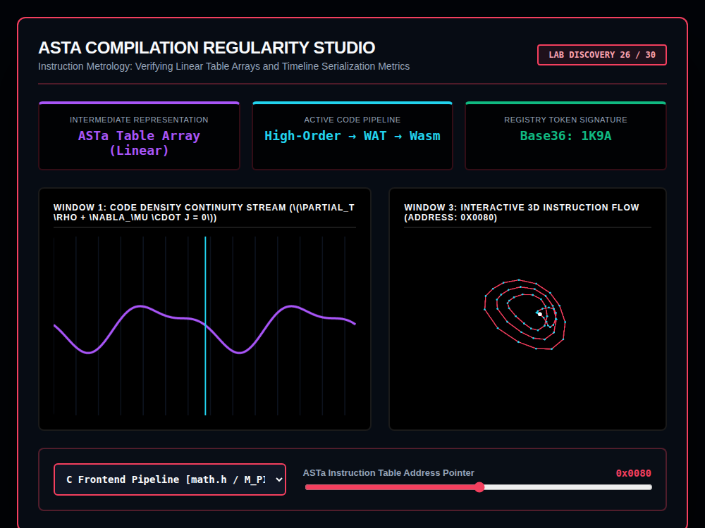

# 9x8_Torus_026.html — ASTa Compilation Regularity Studio [Lab 26 - Fixed]

**Reference implementation:** [`9x8_Torus_026.html`](./9x8_Torus_026.html)
**Screenshot:** 

## What it demonstrates

The title's "[Lab 26 - Fixed]" tag marks this as a bug-fix release: it
reuses [`9x8_Torus_022.html`](./9x8_Torus_022.md)'s compiler/ISA-diagnostics
framing and [`9x8_Torus_024.html`](./9x8_Torus_024.md)'s spline-lattice
rendering code, but here the dropdown is wired correctly
(`document.getElementById('frontendSelect')` matches the actual element
id) — unlike [`9x8_Torus_025.html`](./9x8_Torus_025.md)'s broken
`reactionSelect` lookup, this release's dropdown genuinely drives the
visualization.

- **Frontend pipeline selector**: "C Frontend Pipeline [math.h / M_PI
  Mapping]" and "PHP Frontend Pipeline [$ Sigil Strip / Echo Construct]" —
  these labels describe real per-language front-end concerns (mapping
  `M_PI` in C, stripping the `$` sigil and handling `echo` in PHP), which
  lines up conceptually with this project's actual `RegX.js` compiler
  toolchain (`frontend_c.js`, `frontend_php.js`, and siblings for Java/
  Python/TypeScript) — this release reads as an early visualization
  concept for that per-language-frontend compilation pipeline, labeled
  "High-Order → WAT → Wasm" (source → WebAssembly Text → compiled Wasm).
  Each profile also carries a distinct ring count, point count, and accent
  color, and a "Base36 Registry Token" (`1K9A` for C, `3M5C` for PHP).
- **ASTa Instruction Table Address Pointer slider** (0–255, shown as a hex
  address) sweeps a marker across Window 1's density curve and, in Window
  3, highlights whichever node index on the innermost ring falls near
  `floor(pointerValue / 20)` in bright magenta — visualizing "which AST
  table entry is currently being inspected."

## How the UI works

Same structure as releases 022/024: dropdown + slider drive
`processLinguisticManifold()` (a function name left over from release 024,
despite this release being about compilation rather than linguistics),
wrapped in a `try/catch` guard; Window 3 is draggable; continuous
`requestAnimationFrame` animation; all colors are literal hex. No external
libraries — self-contained HTML/canvas 2D.

## What's in the screenshot

Captured at the default load state: C Frontend Pipeline selected (Base36
token `1K9A`), pointer at `0x0080` — the innermost ring's node nearest
index 6 (`128/20 ≈ 6`) highlighted white/magenta among the red-accented
4-ring lattice.

---
*Part of the CORE reference series, marked "Lab 26 - Fixed" — corrects the
dropdown-wiring bug present in
[`9x8_Torus_025.md`](./9x8_Torus_025.md) and connects the series'
lattice engine to this project's actual multi-language compiler frontends.*
