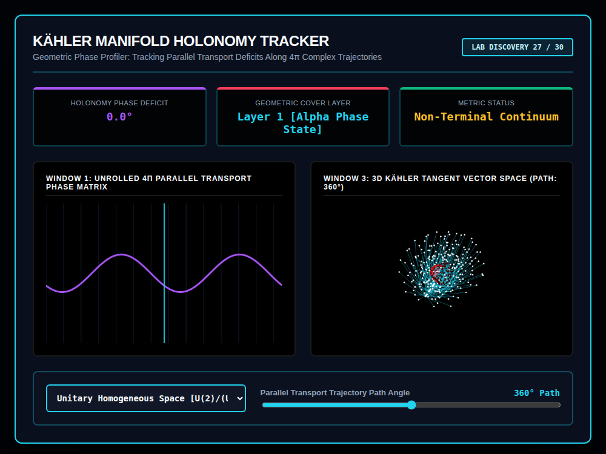

# 9x8_Torus_027.html — Kähler Manifold Holonomy Tracker [Lab 27 - Hardened]

**Reference implementation:** [`9x8_Torus_027.html`](./9x8_Torus_027.html)
**Screenshot:** 

## What it demonstrates

Labeled "Lab Discovery 27/30," this release moves from the series' recurring
applied-domain skins back to pure differential geometry: **parallel
transport and holonomy on a Kähler manifold**. Holonomy is the real
mathematical idea that transporting a vector around a closed loop on a
curved space can rotate it relative to where it started; the amount of
rotation is the "holonomy phase deficit," and this release visualizes that
concept with a slider that runs to **720° (a 4π double cover)** instead of
the usual 360°, reflecting that some geometric spaces (like `U(2)`) need two
full loops before a transported object returns to its exact original state.

- **2 manifold profiles**: "Unitary Homogeneous Space [U(2)/(U(1)×U(1))]"
  and "Complex Projective Space [ℂP^(2^N-1) Manifold]" — both genuine
  families of spaces studied in this area of geometry (a Grassmannian-style
  homogeneous space and complex projective space), each with its own
  ring/point count and accent color.
- **Parallel Transport Trajectory Path Angle slider** (0–720°, double the
  usual 0–360° range) drives `currentDeficit = |(360 − sliderVal) % 360|` —
  the Holonomy Phase Deficit reads 0° whenever `sliderVal` is a multiple of
  360° (i.e. at 0°, 360°, and 720°), framing those points as "the vector has
  returned to itself."
- **Geometric Cover Layer** flips from "Layer 1 [Alpha Phase State]" to
  "Layer 2 [Beta Conjugate State]" once the slider passes 360°, visualizing
  the "double cover" idea directly: the same 0–360° phase is walked twice,
  on two different sheets.
- **Metric Status** reads "Non-Terminal Continuum" everywhere except exactly
  0° and 720°, where it switches to "Identity Reached (Resolved)" — marking
  the two points where the transported vector is back to its starting
  identity.
- **Window 1** ("Unrolled 4π Parallel Transport Phase Matrix") plots the
  full 0–720° phase curve unrolled as a single sine wave, with a vertical
  marker line tracking the slider position across both cover sheets.
- **Window 3** is a draggable 3D shell mesh (4–5 rings depending on
  profile) whose innermost ring's longitude is phase-shifted by the path
  angle; nodes are colored white or dark red (`#440000`) depending on that
  phase shift, and a single "active vector" node is highlighted in red based
  on `Math.floor(sliderVal / 45)`, tracing which node the transported vector
  currently sits at.

## How the UI works

- **Manifold dropdown** and **Path Angle slider** drive
  `processLinguisticManifold()` — a function name inherited unchanged from
  the NLP-themed releases ([024](./9x8_Torus_024.md)) despite this release
  having nothing to do with language; it's the same shell-lattice update
  routine relabeled again for a new domain.
- `window.changeHolonomyProfile` is attached directly to the global
  `window` object (rather than only as a local handler), consistent with
  how dropdown-driven profile switches are wired in several other releases.
- **Window 3 is draggable** (click + drag to rotate), continuing the
  interaction pattern from releases 017 onward.
- Continuous `requestAnimationFrame` animation. All colors are literal hex
  (no CSS-variable quirk).
- No external libraries — self-contained HTML/canvas 2D, with a genuine
  double-cover (0–720°) slider range not seen in any prior release.

## What's in the screenshot

Captured at the default load state: Unitary Homogeneous Space profile,
Path Angle slider at 360° — Holonomy Phase Deficit 0.0°, Geometric Cover
Layer 1 [Alpha Phase State], Metric Status "Non-Terminal Continuum" (360°
is a zero-deficit point but not one of the two Resolved endpoints at 0°/
720°), with Window 1's unrolled phase curve marked at its midpoint and
Window 3's shell lattice showing the red active-vector node.

---
*Part of the CORE reference series — the first release to use a genuine
4π/720° double-cover control range, extending the shell-lattice engine's
"applied profiler" pattern back into pure differential geometry.*
