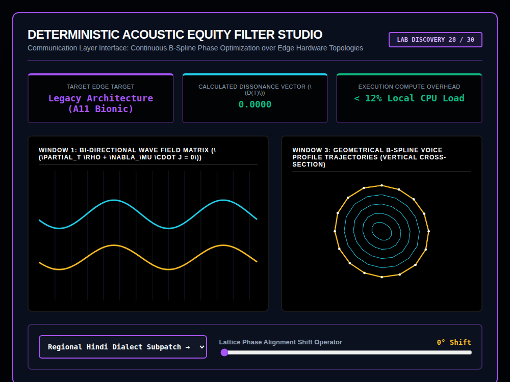

# 9x8_Torus_028.html — Deterministic Acoustic Equity Filter Studio [Lab 28]

**Reference implementation:** [`9x8_Torus_028.html`](./9x8_Torus_028.html)
**Screenshot:** 

## What it demonstrates

Labeled "Lab Discovery 28/30," this release is a near-exact restaging of
[`9x8_Torus_023.html`](./9x8_Torus_023.md)'s "Acoustic Equity Manifold
Station" — same title theme (offline dialect translation on legacy edge
hardware, "A11 Bionic"), same two dialect profiles (Hindi Subpatch / Italian
Nonna Patch), same `processAcousticManifold()` function body, same
Dissonance Vector formula, and the same Window 1 (dual waveform) / Window 3
(concentric B-spline rings) layout. The differences are cosmetic and
presentational:

- Retitled "Deterministic Acoustic Equity Filter Studio" with a purple
  accent theme (release 023 used cyan/pink), and the panel styling switched
  from the series' usual monospace-terminal look to a softer rounded-card
  design (`border-radius: 12px`/`8px`/`6px`, larger shadow, sans-serif
  telemetry labels).
- Both Window 1 and Window 3's telemetry titles carry inline LaTeX (`\(D(t)\)`,
  `\(\partial_t \rho + \nabla_\mu \cdot j = 0\)`), but **no MathJax/KaTeX
  script is loaded anywhere in the file** — the raw `\(...\)` delimiters and
  LaTeX source render as literal text in the browser (visible in the
  screenshot: "CALCULATED DISSONANCE VECTOR (\(D(t)\))"). This is a genuine
  display bug, not a stylistic choice; release 023 avoided it by keeping
  its titles as unescaped Unicode (`D(t)`) instead of LaTeX macros.
- Window 3's rings render noticeably crisper/thinner (`lineWidth` 1.5–4 vs.
  023's similar values) under the label "Vertical Cross-Section," though
  the geometry math driving both is identical.

## How the UI works

Functionally identical to release 023: **Dialect dropdown** and **Lattice
Phase Alignment slider** (0–360°) drive `processAcousticManifold()`
(`try/catch`-guarded); switching dialects resets the phase slider to 0°.
Continuous `requestAnimationFrame` animation. All colors are literal hex
(no CSS-variable quirk this time). No external libraries — and, per the
LaTeX issue above, no math-rendering library either despite using LaTeX
markup in its labels.

## What's in the screenshot

Captured at the default load state: Hindi Subpatch selected, 0° Shift —
Dissonance 0.0000 (green, aligned), the cyan/amber waveforms in Window 1
perfectly in phase, and Window 3's 5 concentric rings undistorted at this
zero-shift setting. The unrendered `\(...\)` LaTeX source is visible in both
viewport titles.

---
*Part of the CORE reference series — a restyled near-duplicate of
[`9x8_Torus_023.md`](./9x8_Torus_023.md), notable chiefly for introducing an
unrendered-LaTeX display bug not present in the earlier release.*
