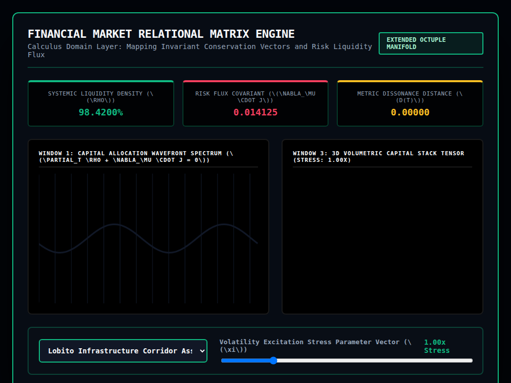

# 9x8_Torus_029.html — Financial Market Relational Matrix Engine [Lab 29]

**Reference implementation:** [`9x8_Torus_029.html`](./9x8_Torus_029.html)
**Screenshot:** 

## What it demonstrates

A fifth "applied profiler" skin over the shell-lattice engine, this one
framed as a **financial risk/liquidity dashboard** ("Extended Octuple
Manifold") built on the same `∂ₜρ + ∇·j = 0` continuity-equation framing
used throughout releases 016–028, here reinterpreted as capital
conservation: liquidity density `ρ` flowing through the system like a fluid,
with a "Risk Flux Covariant" standing in for the divergence term.

- **2 market profiles**: "Lobito Infrastructure Corridor Asset Stack [Layer
  5 Focus]" and "Sovereign Debt Liquidity Pool [Layer 2 Focus]" — each with
  its own baseline liquidity (%), baseline flux, a "focus layer" (which of
  the 5 shell layers gets highlighted), and accent color. "Lobito Corridor"
  is a real infrastructure project name (the Lobito rail corridor in
  Angola), used here as flavor for an infrastructure-asset market profile.
- **Volatility Excitation Stress slider** (50–300, shown as 0.50x–3.00x
  Stress) drives Systemic Liquidity Density down and Risk Flux/Metric
  Dissonance up as stress increases; liquidity turns magenta once it drops
  below 80%.
- **Window 1** plots a capital-allocation wavefront curve whose amplitude
  gets choppier (`frictionWarp`) as stress rises above 1.0x.
- **Window 3** is meant to be a draggable 3D "Capital Stack Tensor" — 5
  layers × 8 rings of nodes, with the profile's focus layer highlighted in
  amber and nodes on that layer turning white/magenta ("stressed assets")
  once stress exceeds 1.5x.

## How the UI works — and a real rendering bug

**Window 3 renders as an empty black canvas** (visible in the screenshot):
the node-generation loop reads `const nodesPerRing = profile.points;`, but
neither `marketDatabase` entry (`macroCorridor`, `sovereignBonds`) defines a
`points` field — only `name`, `baseLiq`, `baseFlux`, `layerFocus`, and
`color`. `nodesPerRing` is therefore `undefined`, so the inner `for(let n=0;
n<nodesPerRing; n++)` loop condition (`n < undefined`) is immediately false
and never executes, and `meshPoints` stays empty for every layer/ring
combination. This is the first release in the series where the 3D viewport
produces no visible output at all, rather than a cosmetic or logic quirk.

A second, smaller issue: several `strokeStyle`/`fillStyle` assignments use
the literal string `'var(--green-neon)'` or `'var(--magenta-neon)'` (e.g.
lines 192, 252, 258, 268) instead of a resolved hex color or the DOM-computed
custom property. Canvas 2D's color parser doesn't evaluate `var()` the way
CSS does, so these assignments are silently ignored and the context keeps
whatever color was already set — visible in the screenshot as Window 1's
wave rendering in a dim slate-gray rather than the intended green.

Both bugs stem from the same root cause as earlier releases' CSS-variable
quirk (a canvas API misuse), but this is the first time in the series that
issue combines with a missing data field to produce a fully blank window
rather than just a wrong color.

Otherwise the control wiring matches the series template: **market
dropdown** and **stress slider** drive `processMarketManifold()`
(`try/catch`-guarded, `window.changeMarketProfile` attached globally as in
release 027); Window 3 has mouse-drag rotation handlers wired (`rotX`/
`rotY`) even though they have nothing to render. Continuous
`requestAnimationFrame` animation. Telemetry titles use unrendered inline
LaTeX (`\(\rho\)`, `\(\nabla_\mu \cdot j\)`), the same missing-MathJax issue
documented in [release 028](./9x8_Torus_028.md).

## What's in the screenshot

Captured at the default load state: Lobito Corridor profile, 1.00x Stress —
Liquidity 98.4200% (green), Risk Flux 0.014125, Dissonance 0.00000. Window 1
shows a faint gray wave (the `var(--green-neon)` strokeStyle bug). Window 3
is entirely blank (the `profile.points` bug). Both telemetry titles show
raw, unrendered LaTeX source.

---
*Part of the CORE reference series — a fifth applied-profiler skin over the
shell engine, and the first release whose 3D viewport fails to render any
content due to a missing-field bug in its profile data.*
