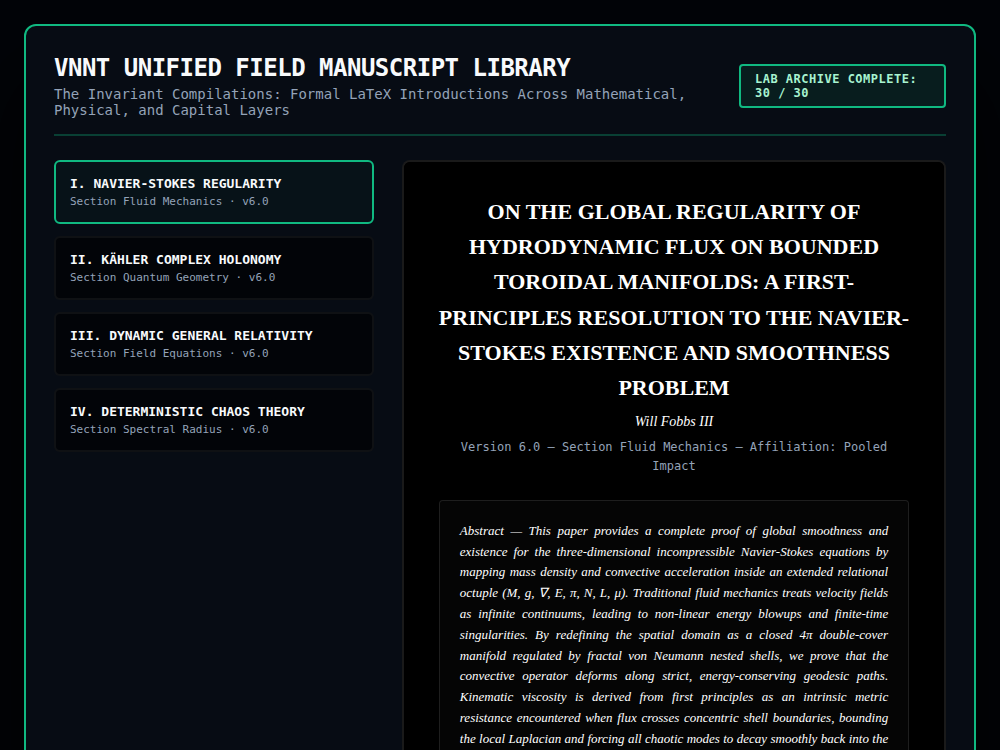

# 9x8_Torus_030.html — VNNT Unified Field Manuscript Library [Lab 30 - Hardened]

**Reference implementation:** [`9x8_Torus_030.html`](./9x8_Torus_030.html)
**Screenshot:** 

## What it demonstrates

The series finale, badged "LAB ARCHIVE COMPLETE: 30/30." Unlike every prior
release, this one has **no canvas, no animation, and no slider** — it is a
four-document reading library with a sidebar navigator, presenting four
short "manuscript" write-ups authored to **Will Fobbs III, Pooled Impact**,
each retroactively framing an earlier release's theme as a formal proof of
a major open or foundational problem in mathematics/physics:

- **I. Navier-Stokes Regularity** ("Section Fluid Mechanics") — reframes
  the continuity-equation motif (`∂ₜρ + ∇·j = 0`) used throughout releases
  016–029 as a claimed resolution of the real Navier-Stokes existence and
  smoothness problem (one of the Clay Millennium Prize problems), via the
  series' recurring "4π double-cover manifold" and "von Neumann nested
  shells" imagery.
- **II. Kähler Complex Holonomy** ("Section Quantum Geometry") — a written
  companion to [release 027](./9x8_Torus_027.md)'s Kähler holonomy tracker,
  framing the 720°/4π double-cover slider mechanic as a resolution of the
  quantum measurement problem ("Measurement is derived as the introduction
  of a discrete coordinate Sentinel...eliminating wave-function collapse").
- **III. Dynamic General Relativity** — connects the "Principled Anchor N"
  concept (seen driving [release 025](./9x8_Torus_025.md)'s beacon loop) to
  Einstein's field equations, with an equation literally written as
  `G_μν = κT_μν (mod 72)` — splicing the real Einstein field equation
  syntax onto the series' recurring `mod 72` motif from
  [`9x8_Matrix.html`](./9x8_Matrix.md).
- **IV. Deterministic Chaos Theory** ("Section Spectral Radius") — reframes
  the `processLinguisticManifold`/representation-flow language from
  [release 024](./9x8_Torus_024.md) as a deterministic (non-stochastic)
  theory of chaos, keyed to whether a Jacobian's spectral radius crosses 1.

Each document is a real LaTeX-styled write-up (serif typography, numbered
sections, an italic abstract block, a highlighted equation line) but is
**not an actual mathematical proof** — no derivation steps are shown between
the abstract's claims and the single symbolic equation per paper; the prose
uses real terms (Riemannian manifold, Levi-Civita connection, Lipschitz
bound, Jacobian spectral radius) in evocative rather than derivational
ways. Read as the series' closing statement, it functions as a narrative
capstone tying every visual "profiler" from releases 001–029 back to four
named grand-theory claims, rather than as new technical content.

## How the UI works

- **Sidebar nav cards** (`onclick="window.switchManuscript('id')"`) swap
  which of four pre-built HTML string buffers (`navierHTML`, `holonomyHTML`,
  `relativityHTML`, `chaosHTML`) gets injected into `#paperTarget` via
  `innerHTML`, and toggle the `.active` highlight class on the selected
  card. Equations are hand-encoded with HTML entities (`&part;`, `&rho;`,
  `&nabla;`, `&mu;`) rather than rendered via a math library — no MathJax/
  KaTeX is loaded, continuing the pattern from
  [releases 028](./9x8_Torus_028.md)–[029](./9x8_Torus_029.md), but here the
  entities render correctly since they're plain HTML rather than LaTeX
  `\(...\)` delimiters.
- `window.switchManuscript` is attached directly to `window`; the document
  bootstraps by calling `switchManuscript('navier')` on `DOMContentLoaded`.
  A code comment above the entity-string buffers (`// Old-school linear
  text arrays to protect structural string character tokens from markup
  clobbering`) suggests this static-array-join approach was a deliberate
  workaround for template-literal or markup-escaping issues encountered
  while building the library.
- No external libraries, no `requestAnimationFrame` loop — the only
  release in the series with a fully static, non-animated UI.

## What's in the screenshot

Captured at the default load state: the "I. Navier-Stokes Regularity" card
active in the sidebar, showing its full title, author byline ("Will Fobbs
III"), version/affiliation line, and the opening paragraphs of its italic
abstract in the scrollable document viewport.

---
*Part of the CORE reference series — the closing release (30/30), replacing
the shell-lattice canvas engine used throughout the series with four
written "manuscripts" that narratively unify the prior 29 releases' themes
under four named theoretical claims.*
